# Gamingbarn/GBG

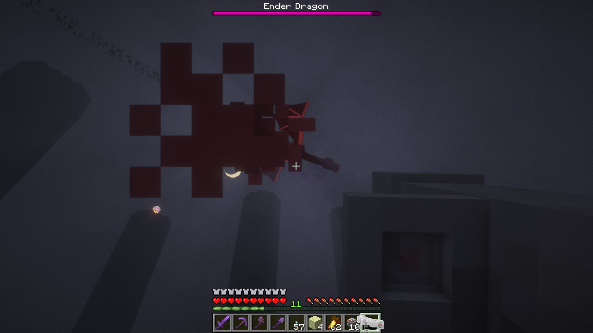

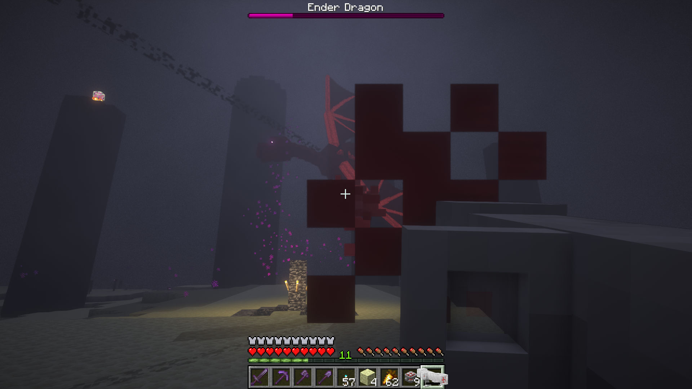

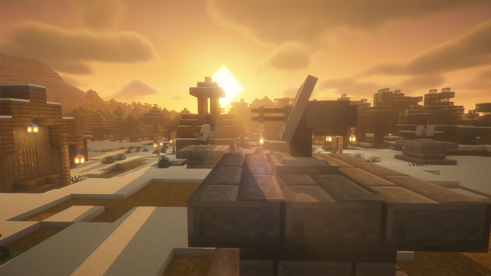

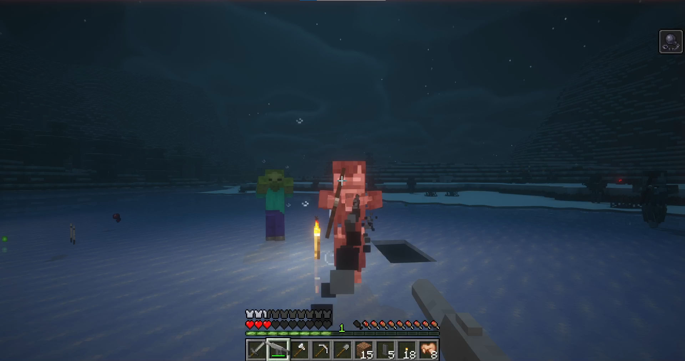

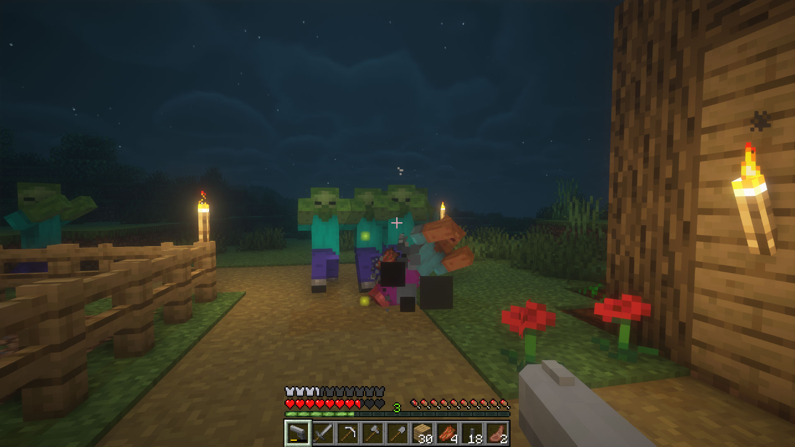

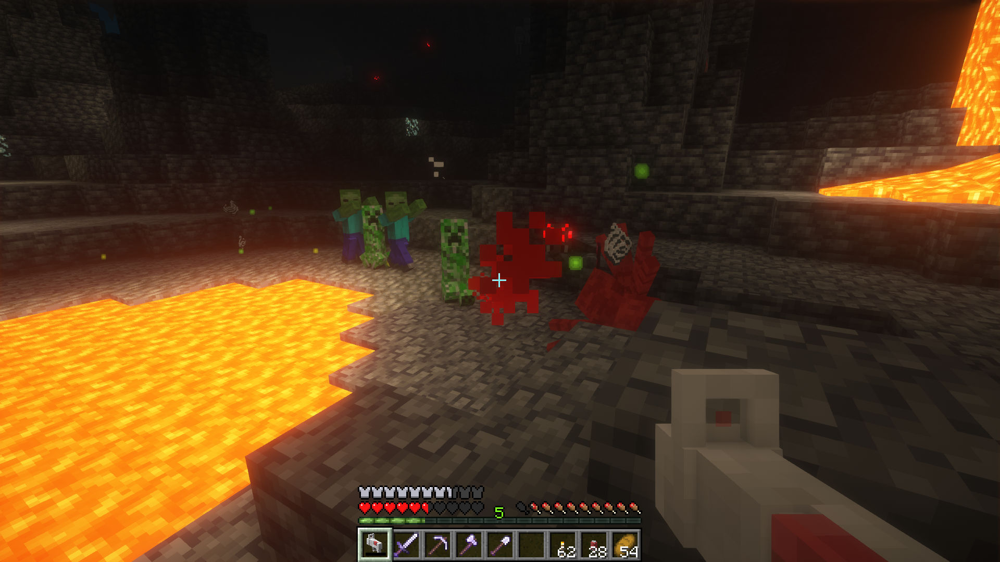

## General

Gamingbarn's Guns enhances your Minecraft world with the addition of 15 brand new firearms, 9 dynamic medical supplies, 7 game-changing equipment items, and 3 defensive turrets. Each item offers unique benefits and drawbacks to enhance the tactical depth of your gameplay.

All of the recipes of the items added by this pack can be viewed in the vanilla crafting table recipe book.

You shoot the guns with right click and reload by pressing F, or whatever key you have bound to "swap with offhand".

**Guns**

Naturally, a datapack called Gamingbarn's Guns would add guns. The guns added by this datapack are organized into three major categories: Standard, Laser, & Ray.

#### Standard

The Standard gun category is comprised of guns that are based on general categories of real-life firearms. This category of guns is the cheapest, but that doesn't make them any less powerful!

**Pistol**

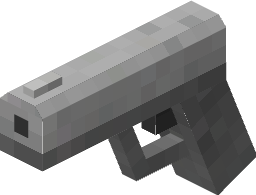

The Pistol is an all-round good gun, with medium range, damage, and recoil. It's a solid choice for most situations and is a reliable gun for early, mid, and even late game. The bullets, while not terribly powerful, are capable of piercing through armor better than the Assault Rifle or Shotgun.

.png>)

Crafting Recipe

* 3x Iron Ingots
* 2x Light Gray Concrete

Stats

* Magazine Size - 16
* Damage - 9
* Range - 50
* Rate of Fire - 10 ticks
* Reload Speed - 50 ticks
* Recoil - 6/14

This gun uses Pistol Magazines  as ammunition.

**Assault Rifle**

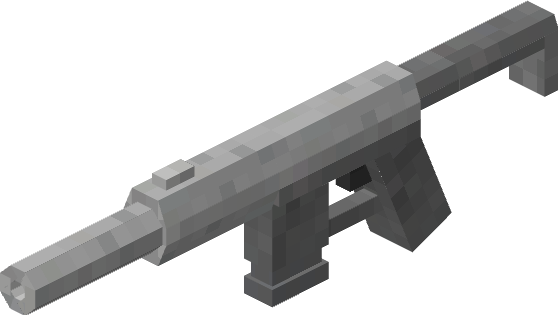

The Assault Rifle is a unique gun. It has low range & damage, but it sports a very high rate of fire. The main caveat of the Assault Rifle is that it is quite weak against armored targets. This makes the gun exceptionally powerful against unarmored players and monsters, but falls off rather swiftly against armor-wearing players and monsters.

.png>)

Crafting Recipe

* 5x Iron Ingots
* 2x Light Gray Concrete

Stats

* Magazine Size - 32
* Damage - 4
* Range - 36
* Rate of Fire - 4 ticks
* Reload Speed - 42 ticks
* Recoil - 3/14

This gun uses Assault Rifle Magazines  as ammunition.

**Shotgun**

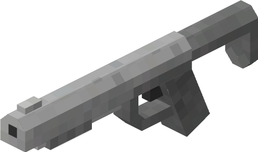

The Shotgun has very high damage, and a fairly strong rate of fire as well. This gun shoots pellets instead of bullets, which allows the gun to deal damage to multiple targets at once. However, due to the nature of these projectiles, the gun is unable to pierce through armor. This gun is perfect against high-hp, low-armor targets or against swift, hard-to-hit mobs, like baby zombies or vexes.

.png>)

Crafting Recipe

* 5x Iron Ingots
* 2x Light Gray Concrete

Stats

* Magazine Size - 8
* Damage - 18
* Range - 22
* Rate of Fire - 20 ticks
* Reload Speed - 10 ticks
* Recoil - 6/14

This gun uses Shotgun Shells  as ammunition.

**Sniper Rifle**

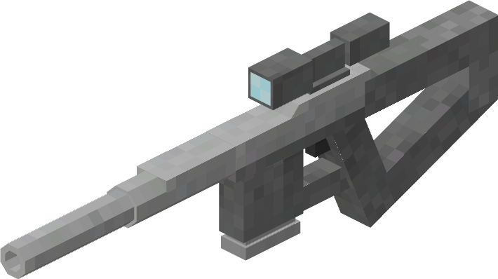

On the surface, the Sniper Rifle is the most powerful of the standard guns. With the highest damage and range of the standard guns, it is quite the formidable weapon. Additionally, due to the powerful bullets fired by this weapon, the Sniper Rifle is the most effective of the standard guns against armored targets. However, the Sniper Rifle is plagued by a low rate of fire, making swift-moving targets a practical nightmare.

.png>)

Crafting Recipe

* 3x Iron Ingots
* 3x Light Gray Concrete

Stats

* Magazine Size - 4
* Damage - 21
* Range - 110
* Rate of Fire - 35 ticks
* Reload Speed - 35 ticks
* Recoil - 9/14

This gun uses Sniper Rifle Magazines  as ammunition.

**Bazooka**

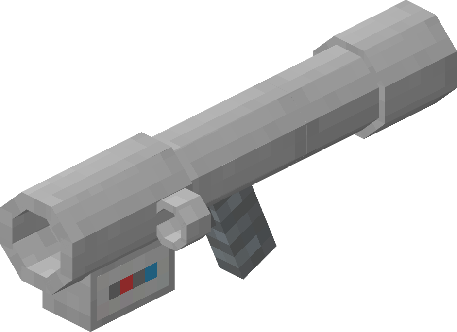

The Bazooka is exactly what you think it is. The range is among the highest of all guns, and the damage is very strong as well. However, the projectile takes time to hit its target. But if you can manage to plan your shot just right, you'll certainly be able to pack a punch!

.png>)

Crafting Recipe

* 2x Iron Block
* 2x Iron Ingot
* 1x Iron Nugget

Stats

* Magazine Size - 1
* Damage - 43
* Range - 100
* Rate of Fire - 10 ticks
* Reload Speed - 70 ticks
* Recoil - 10/14

This gun uses Rockets 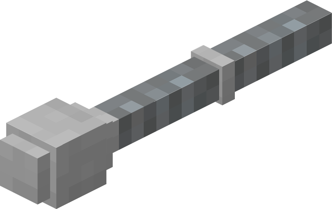 as ammunition.

**Flamethrower**

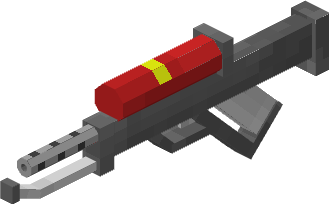

The Flamethrower does exactly what it says, it throws flames. It throws a lot of flames too. With a large magazine alongside a 4 tick rate of fire, the Flamethrower is fully prepared to engulf any potential threats in flames. Don't be fooled by its low damage, the Flamethrower completely ignores any armor on the target, making this gun primed and ready for player toasting! The Flamethrower is also ideal for mass burning, whether its a forest or your buddy's house.

.png>)

Crafting Recipe

* 4x Iron Ingots
* 1x Iron Nugget

Stats

* Magazine Size - 50
* Damage - 2
* Range - 8
* Rate of Fire - 4 ticks
* Reload Speed - 25 ticks
* Recoil - 3/14

This gun uses Flamethrower Canisters  as ammunition.

**Minigun**

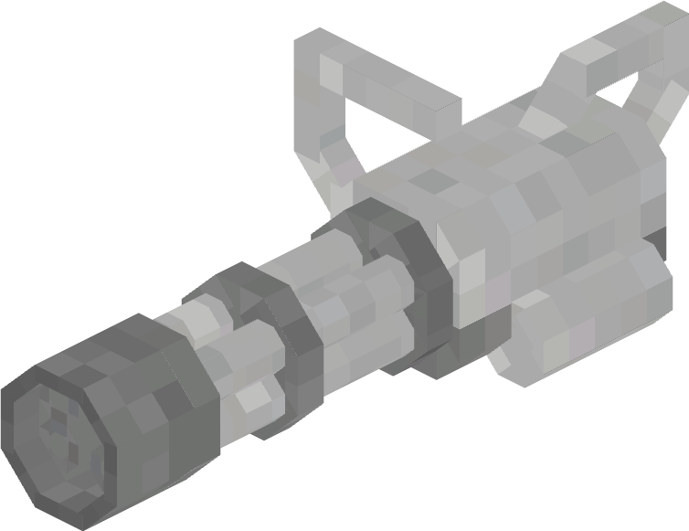

The Minigun is a very powerful weapon. It boasts the highest fire rate out of all of the guns in the datapack, not to mention the massive magazine size. The main downside lies within its relatively low range and its high cost.

.png>)

Crafting Recipe

* 1x Light Gray Concrete
* 2x Iron Block
* 3x Iron Ingots

Stats

* Magazine Size - 100
* Damage - 5
* Range - 36
* Rate of Fire - 2 ticks
* Reload Speed - 70 ticks
* Recoil - 3/14

This gun uses Minigun Canisters 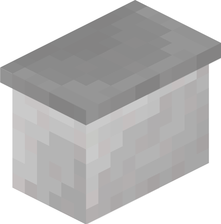 as ammunition.

#### Laser

The Laser category of guns is comprised of, you guessed it, laser guns. This category boasts exceptionally high stats at the cost of expensive guns and ammunition.

**Laser Pistol**

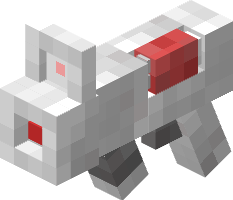

The Laser Pistol is an all-round good weapon. With damage high enough to one-shot most mobs alongside its amazing range and rate of fire, it's definitely not to be ignored. However, due to the size and relative power of the gun, the damage can be reduced if the target is armored heavily enough.

.png>)

Crafting Recipe

* 1x Iron Block
* 3x Iron Ingots
* 1x Redstone Block

Stats

* Magazine Size - 8
* Damage - 22
* Range - 70
* Rate of Fire - 20 ticks
* Reload Speed - 35 ticks
* Recoil - 5/14

This gun uses 9V Laser Batteries  as ammunition.

**Laser Rifle**

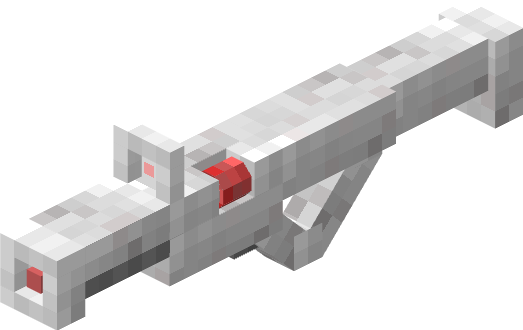

The Laser Rifle is basically a beefier, more expensive Laser Pistol. With high damage, high range, and the ability to pierce through armor, the Laser Rifle is a very powerful weapon. The only caveat being the cost of batteries.

.png>)

Crafting Recipe

* 2x Iron Blocks
* 3x Iron Ingots
* 2x Iron Bars
* 1x Redstone Block

Stats

* Magazine Size - 4
* Damage - 30
* Range - 90
* Rate of Fire - 30 ticks
* Reload Speed - 35 ticks
* Recoil - 6/14

This gun uses 15V Laser Batteries  as ammunition.

**Assault Laser Rifle**

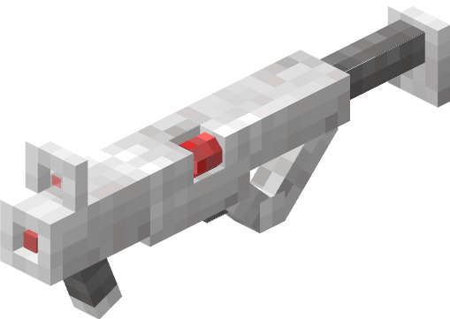

The Assault Laser Rifle is very similar to the Assault Rifle, except with much higher range & damage. The biggest difference between the two comes down to the armor piercing potential. The Assault Laser Rifle is much better against armored targets.

.png>)

Crafting Recipe

* 3x Iron Blocks
* 2x Iron Ingots
* 1x Redstone Block

Stats

* Magazine Size - 48
* Damage - 5
* Range - 74
* Rate of Fire - 4 ticks
* Reload Speed - 35 ticks
* Recoil - 3/14

This gun uses 15V Laser Batteries  as ammunition.

**Laser Cannon**

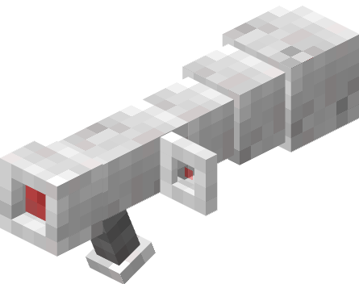

The Laser Cannon is the most powerful gun in Gamingbarn's guns. With the highest range and damage, it's quite the force to be reckoned with. Despite being an explosive weapon, it doesn't break blocks. Don't be fooled by its high rate of fire, however, the reload speed is among the lowest of all guns.

.png>)

Crafting Recipe

* 3x Iron Blocks
* 1x Iron Ingot
* 1x Redstone Block
* 1x 15V Laser Battery Bundle

Stats

* Magazine Size - 1
* Damage - 57
* Range - 122
* Rate of Fire - 10 ticks
* Reload Speed - 70 ticks
* Recoil - 10/14

This gun uses 15V Laser Battery Bundles 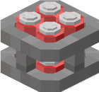 as ammunition.

#### Ray

Ray guns are very unique as they do not require ammunition & they don't have recoil. In addition, their projectiles also have an unusually high ability to pierce through armor. This may make Ray Guns seem very attractive, but beware, these guns have very low stats in exchange for this.

**Ray Gun: Green**

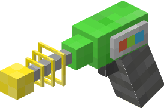

The Ray Gun: Green has a solid balance of fire rate, damage, and range. This combination makes the Ray Gun: Green the best general-use ray gun.

.png>)

Crafting Recipe

* 2x Iron Ingots
* 1x Iron Bars
* 2x Gold Ingots
* 1x End Crystal
* 3x Lime Concrete

Stats

* Magazine Size - Infinite
* Damage - 6
* Range - 20
* Rate of Fire - 20 ticks
* Recoil - 0/14

**Ray Gun: Blue**

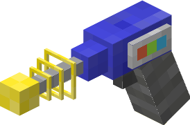

The Ray Gun: Blue has the high damage alongside the highest range of the ray guns. In wake of this, however, is that the fire rate is the lowest of the ray guns.

.png>)

Crafting Recipe

* 2x Iron Ingots
* 1x Iron Bars
* 2x Gold Ingots
* 1x End Crystal
* 3x Blue Concrete

Stats

* Magazine Size - Infinite
* Damage - 11
* Range - 48
* Rate of Fire - 45 tick
* Recoil - 0/14

**Ray Gun: Pink**

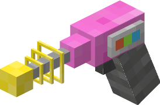

The Ray Gun: Pink is unique in that its shots explode on impact, and don't even break blocks! The catch to this is that the gun functions a lot like a space-age grenade launcher, meaning your shots are heavily affected by gravity and take time to hit their target. If you can get used to this, you have a very powerful weapon in your hands.

.png>)

Crafting Recipe

* 2x Iron Ingots
* 1x Iron Bars
* 2x Gold Ingots
* 1x End Crystal
* 3x Pink Concrete

Stats

* Magazine Size - Infinite
* Damage - 29
* Range - 70
* Rate of Fire - 25 ticks
* Recoil - 0/14

**Ray Gun: Red**

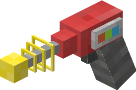

The Ray Gun: Red may have a low range and low damage, but this ray gun has an incredibly fast rate of fire. This results in the gun having very unique use case, akin to that of the assault rifle.

.png>)

Crafting Recipe

* 2x Iron Ingots
* 1x Iron Bars
* 2x Gold Ingots
* 1x End Crystal
* 3x Red Concrete

Stats

* Magazine Size - Infinite
* Damage - 1
* Range - 18
* Rate of Fire - 4 ticks
* Recoil - 0/14

## Ammo

As one would expect, most of the guns will require and use ammunition. While often an afterthought, it's vitally important to understand what ammo you need and how to get it.

#### Standard

**Pistol Magazine**

.png>)

Crafting Recipe

* 5x Iron Nuggets
* 1x Gunpowder

Crafting gives 2 Pistol Magazines.

**Assault Rifle Magazine**

.png>)

Crafting Recipe

* 1x Iron Ingot
* 1x Gunpowder

Crafting gives 2 Assault Rifle Magazines.

**Shotgun Shell**

.png>)

Crafting Recipe

* 1x Iron Ingot
* 1x Gold Ingot
* 1x Gunpowder

Crafting gives 12 Shotgun Shells.

**Sniper Rifle Magazine**

.png>)

Crafting Recipe

* 2x Iron Ingots
* 1x Gunpowder

Crafting gives 3 Sniper Rifle Magazines.

**Rocket**

.png>)

Crafting Recipe

* 3x Gunpowder
* 3x Iron Ingots
* 2x Iron Nuggets

Crafting gives 3 Rockets.

**Flamethrower Canister**

.png>)

Crafting Recipe

* 2x Iron Ingots
* 3x Fire Charge

Crafting gives 1 Flamethrower Canister.

**Minigun Canister**

.png>)

Crafting Recipe

* 4x Gunpowder
* 2x Iron Ingots
* 2x Iron Nuggets

Crafting gives 1 Minigun Canister.

#### Laser

**9V Laser Battery**

.png>)

Crafting Recipe

* 3x Iron Ingots
* 3x Copper Ingots
* 1x Redstone Block
* 2x Redstone Dust

Crafting gives 3 9V Laser Batteries.

**15V Laser Battery**

.png>)

Crafting Recipe

* 1x Iron Block
* 2x Iron Ingots
* 1x Copper Block
* 2x Copper Ingots
* 1x Redstone Block
* 2x Redstone Dust

Crafting gives 2 15V Laser Batteries.

**15V Laser Battery Bundle**

.png>)

Crafting Recipe

* 4x 15V Laser Batteries

Crafting gives 1 15V Laser Battery Bundle.

## Medical

The medical items are crucial to effective combat within Gamingbarn's Guns. Understanding what medical items you can craft and what they do can turn the tide of any battle.

**Simple Bandage**

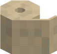

The Simple Bandage is renowned for its cheap cost. Costing only three wool makes it easy to obtain very early game. However, the Simple Bandage isn't the best healing item, as it only heals four hp over a short period.

.png>)

Crafting Recipe

* 3x White Wool

Stats

* Effects - Regeneration II (00:05)
* Use Time - 30 ticks

**Advanced Bandage**

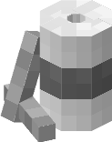

The Advanced Bandage is a better variant of the Simple Bandage. It costs more resources, but is double as effective. The Advanced Bandage restores eight hp over a short period of time.

.png>)

Crafting Recipe

* 3x White Wool
* 3x Sticks
* 2x Paper
* 1x Iron Ingot

Stats

* Effects - Regeneration II (00:10)
* Use Time - 30 ticks

**Medkit**

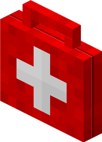

The Medkit is a very solid medical item. It will instantly restore five hp and heal an additional four over time. The Medkit's big attribute that sets it apart from the rest, is its ability to clear all negative effects. The Medkit will remove negative effects (like poison and mining fatigue) but keep the positive effects (like speed and haste).

.png>)

Crafting Recipe

* 1x White Wool
* 1x Red Wool
* 1x Paper
* 1x Leather
* 1x Stick
* 1x Milk Bucket

Stats

* Effects - Regeneration II (00:09) / Regeneration II (00:10)
* Clears all Negative Effects
* Use Time - 60 ticks

**Syringe**

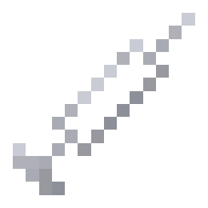

The Syringe does nothing on its own, quite similar to a glass bottle. But also similar to a glass bottle, the Syringe can be used in a multitude of recipes to create items to grant the user various effects.

.png>)

Crafting Recipe

* 2x Glass
* 1x Iron Ingot

Stats

* Effects - None

**Regeneration Syringe**

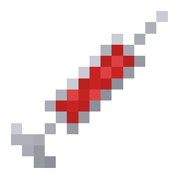

The Regeneration Syringe applies the regeneration effect when used. It's similar to a regeneration potion, except it will apply the effect instantly. Its recipe is also fairly cheaper as well. The Regeneration Syringe heals about sixteen hp.

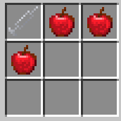

Crafting Recipe

* 1x Syringe
* 3x Apples

Stats

* Effects - Regeneration II (00:20)
* Use Time - 10 ticks

**Absorption Syringe**

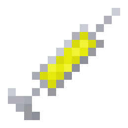

The Absorption Syringe applies the absorption effect to the user. Absorption hearts are functionally additional hp, except they cannot be regenerated. The Absorption Syringe grants eight absorption hearts.

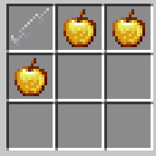

Crafting Recipe

* 1x Syringe
* 3x Golden Apples

Stats

* Effects - Absorption IV (08:00)
* Use Time - 10 ticks

**Swiftness Syringe**

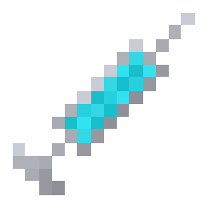

The Swiftness Syringe grants a great speed effect for a short period of time. This makes the Swiftness Syringe ideal for a swift getaway or for use in melee/short range combat.

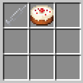

Crafting Recipe

* 1x Syringe
* 1x Cake

Stats

* Effects - Swiftness IV (00:30)
* Use Time - 10 ticks

**Resistance Syringe**

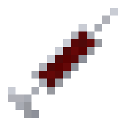

The Resistance Syringe applies the resistance effect. Not only is the resistance effect good at protecting from various forms of damage, it also reduces incoming damage from gun projectiles.

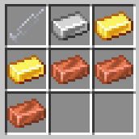

Crafting Recipe

* 1x Syringe
* 3x Copper Ingots
* 2x Gold Ingots
* 1x Iron Ingot

Stats

* Effects - Resistance (01:00)
* Use Time - 10 ticks

**Health Boost Syringe**

The Health Boost Syringe is one of the most important items. It increases the user's maximum hp by eight points for a medium period of time. While more powerful options are available, its low cost makes it quite the essential item to have, especially early-game.

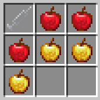

Crafting Recipe

* 1x Syringe
* 3x Golden Apples
* 3x Apples

Stats

* Effects - Health Boost II (06:30)
* Use Time - 10 ticks

**Antidote Syringe**

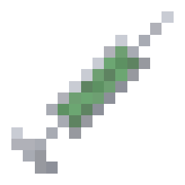

The Antidote Syringe will cure the user of the poison and wither status effects. This makes the item especially handy to have when fighting against Cave Spiders or players with Chemical Grenades.

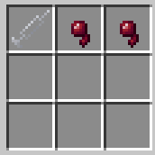

Crafting Recipe

* 1x Syringe
* 2x Spider Eye

Stats

* Effects - Removes Poison and Wither Status Effects

**Laser Shield**

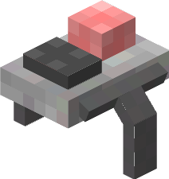

The Laser Shield is a very powerful item. Upon consumption, it doubles the user's base hp for twenty minutes. This immense hp boost can prove to be invaluable when fighting against opponents with high damaging guns.

.png>)

Crafting Recipe

* 3x Iron Ingot
* 3x Redstone Dust
* 1x 15V Laser Battery Bundle

Stats

* Effects - Health Boost V (20:00), Regeneration V (00:05)
* Use Time - 10 ticks

## Equipment

There are two main types of equipment items: placeables and throwables. The placeables can be placed down on the ground, much like a block, and the throwables can be thrown very similarly to snowballs and enderpearls. Equipment items may not be perfect in any situation like a firearm, but knowing what items are at your disposal can change the tide of any encounter.

**C4**

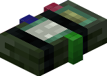

The C4 is a basic remote explosive. The C4 can be placed down and then detonated whenever you'd like. It is useful in offensive and defensive situations. The C4 can also be used for large-scale controlled explosions, whether it's a hill or your friend's base that you're blowing up.

.png>)

Crafting Recipe

* 5x Iron Ingots
* 2x Green Concrete
* 1x Redstone Block
* 1x TNT

Stats

* Damage - 43
* Effects - Explodes via Remote

**C4 Remote**

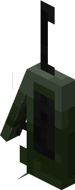

The C4 Remote allows the player to explode their nearby C4s whenever they please. The C4 Remote is capable of activating up to 200 C4s at a time.

.png>)

Crafting Recipe

* 2x Iron Ingot
* 1x Redstone Dust

Stats

* Uses - 5
* Range - 50

**Landmine**

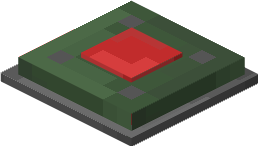

The Landmine is a simple device that produces an explosion when a mob comes into contact with it. Landmines will also explode whenever they are shot by arrows or tridents, which can be utilized to explode Landmines from a distance.

.png>)

Crafting Recipe

* 2x Iron Ingots
* 2x Green Concrete
* 1x Heavy Weighted Pressure Plate
* 1x Redstone Block
* 1x TNT

Stats

* Damage - 43
* Effects - Explodes on Contact

**Pipe Bomb**

The Pipe Bomb is a very simple throwable explosive. Upon impact, it will produce a small explosion that will damage nearby entities. The explosion is very small and won't break blocks very well. That being said, the explosive itself deals a solid amount of AoE damage.

.png>)

Crafting Recipe

* 2x Copper Ingots
* 1x Gunpowder
* 1x String

Stats

* Damage - 14
* Effects - None

**Molotov Cocktail**

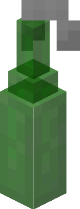

The Molotov Cocktail is a fire-producing throwable. Upon impact, it will produce fire in a 3x3x3 area. It doesn't do very much damage on the surface, but the lingering fire left by its detonation will certainly pack a punch.

.png>)

Crafting Recipe

* 1x Glass Bottle
* 1x Fire Charge
* 1x White Wool

Stats

* Damage - 2
* Effects - Fire in Small Area

**Grenade**

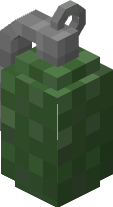

The Grenade is the most powerful throwable. Upon impact, it will produce a large explosion, very similar to that of a creeper. Be mindful, however, as it will break blocks very easily. In addition to the damage brought by the explosion, the Grenade also deals some flat AoE damage.

.png>)

Crafting Recipe

* 6x Copper Ingot
* 3x Gunpowder

Stats

* Damage - 49
* Effects - None

**Chemical Grenade**

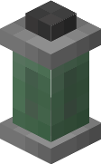

The Chemical Grenade is a unique throwable. It won't break blocks or damage its surroundings, or even inflict any flat damage. However, it will poison and apply other negative effects to any entities in the target area.

.png>)

Crafting Recipe

* 1x Iron Ingot
* 1x Spider Eye
* 1x Slime Ball

Stats

* Damage - 0
* Effects - Wither, Slowness, Weakness, Mining Fatigue

## Turrets

Turrets are powerful items that can be placed down on the ground. Once placed, they will shoot at nearby targets. Currently, there are 3 turrets added by Gamingbarn's Guns. Given the built-in turret menu, these turrets may seem complicated at first. However, it won't take long to get a good understanding of them.

**Auto Turret**

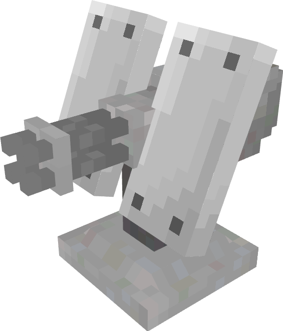

.png>)

Crafting Recipe

* 1x Iron Block
* 5x Iron Ingot
* 2x Gunpowder
* 1x Redstone Dust

Stats

* Health - 60
* Armor - 8
* Damage - 3
* Range - 24
* Rate of Fire - 14 ticks
* Effects - None

The Auto Turret is the simplest of the turrets added by Gamingbarn's Guns. While it might not boast any special abilities, it has the highest flat range and damage of all turrets.

**Sentry Turret**

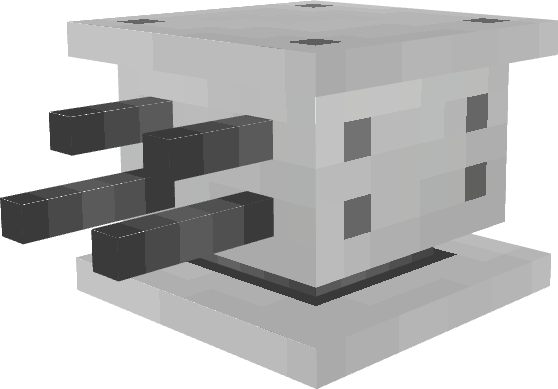

.png>)

Crafting Recipe

* 1x Iron Block
* 4x Iron Ingot
* 1x Gunpowder
* 3x Redstone Dust

Stats

* Health - 40
* Armor - 3
* Damage - 2
* Range - 18
* Rate of Fire - 24 ticks
* Effects - Hides Underground

The Sentry Turret is the most fragile of all the turrets, but it makes up for this in its ability to hide underground. This turret is best used for either surprising attacking players, or for secretly defending your base.

**Perdition Turret**

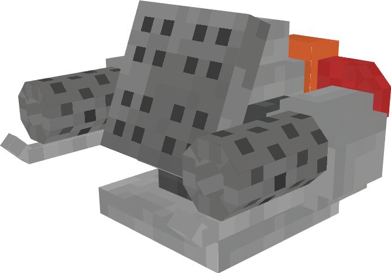

.png>)

Crafting Recipe

* 1x Iron Block
* 6x Iron Ingot
* 1x Gunpowder
* 1x Blaze Powder

Stats

* Health - 100
* Armor - 16
* Damage - 2
* Range - 7
* Rate of Fire - 22 Ticks
* Effects - Hides Underground; Incendiary

The Perdition Turret might be lacking in damage and range, but it more than makes up for that with its insane bulkiness. When underground, the turret is practically invincible, not to mention that the incendiary nature of the projectiles allows the turret to ignore target armor. It is recommended that you put this turret in front of other turrets.

### Turret Menu

By running the command in chat, /trigger turret\_settings, while standing near a turret you can bring up a menu in chat that can be used to do several different things to the turret.

* Turret Type — The Type of Turret You're Editing. (Auto Turret, Sentry Turret, etc)
* Target Type — What the Turret will shoot at
* Repair Turret — Spend 1 iron ingot to heal the Turret for 10 HP
* Pickup Turret — Remove the Turret and receive it as an item. Turret must be at full HP
* Salvage Turret — Remove the Turret for a portion of the resources. Turret must be in the destroyed stage

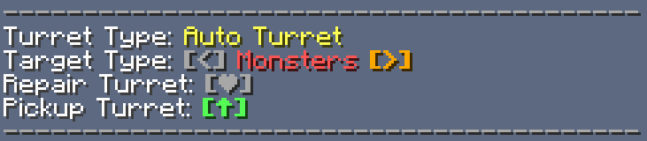 

### Stages



### Functional

The functional stage is what all turrets start in. The turret functions as expected, it will shoot at whatever its target is set to. Any mobs the turret shoots at will try to attack the turret.



### Damaged

In this stage, the turret stops moving and will no longer shoot at targets. However, the turret can be repaired and restored to the Functional stage. Any mobs attacking the turret will stop attacking.



### Destroyed

Once the turret enters this stage, the turret has taken far too much damage to be repaired. The turret, however, can be salvaged to gain a portion of the resources used to craft it. If the turret is not salvaged, after around twenty minutes it will despawn.

Since all mobs stop attacking the turret once it enters the damaged stage, it's most likely that the turret was attacked by a player if it is in the destroyed stage. (This can also occur if the turret was attacked by a Warden or Wither.)



## Commands

There are a series of commands added by Gamingbarn's Guns that an operator can use to get more out of the datapack

**Configuration**

You can access the operator in-game configuration menu by running the command: /function config:gbg

In this configuration menu, you can change the following things:

* The default target type of all turrets when placed down.
* Whether or not the progress bar appears while reloading.
* Whether or not the progress bar appears while using medical/equipment items.

There is also a configuration menu for non-operator players as well: /trigger config\_gbg

The only thing that players can change here currently, are the colors of the gun's description.

##
