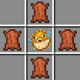

# М’яч

М’яч у Minecraft має реалістичну фізику: він відскакує, котиться, реагує на швидкість гравця й навіть може підкидатися вгору. Це відкриває можливості для веселих ігор — футбол, волейбол або будь-які інші активності з м’ячем.

***

### 🎮 Як грати

Після отримання м’яча  можна одразу починати гру.

#### ⚙️ Управління м’ячем

* **Підійти до м’яча** — легкий удар.
* **Бігти до м’яча** — сильніший удар.
* **Присісти (Shift)** поруч — потужний підйомний удар.
* **Shift + ПКМ (порожньою рукою)** — підняти м’яч.
* **ЛКМ**, тримаючи м’яч — кинути його (сила залежить від швидкості та дії).
* **Shift + утримання** — заряджений кидок (з’являється шкала сили).
* **Shift + ЛКМ** — виконати кидок із зарядом.
* **ПКМ по блоку**, тримаючи м’яч — покласти його на землю.

> 💡 М’яч реагує на напрямок і швидкість руху гравця, тому для сильного удару зроби розгін.

***

### ⚒️ Крафт м’яча

📦 **Рецепт:** 4 шкіри + 1 риба-фугу\
📝 Після крафту ти отримаєш один **м’яч**.

***

<figure><figcaption></figcaption></figure>

### 🎨 Забарвлення м’яча

М’яч можна **пофарбувати в один із доступних кольорів**. Це не змінює його фізику — лише зовнішній вигляд.

#### Доступні кольори:

| Тип фарби            | Колір м’яча       |
| -------------------- | ----------------- |
| 🔴 Червона фарба     | Червоний м’яч     |
| 🟠 Помаранчева фарба | Помаранчевий м’яч |
| ⚪ Біла фарба         | Білий м’яч        |
| 🔵 Синя фарба        | Синій м’яч        |
| 🟢 Зелена фарба      | Зелений м’яч      |
| ⚫ Чорна фарба        | Чорний м’яч       |
| 🟡 Жовта фарба       | Жовтий м’яч       |
| 🟣 Фіолетова фарба   | Фіолетовий м’яч   |
| 🩵 Блакитна фарба    | Блакитний м’яч    |

#### Як пофарбувати м’яч

1. Тримай м’яч у руці.
2. Відкрий чат та введи **/physicalball skin menu**, щоб змінити його колір.

***

#### Як відкрити меню налаштувань

1. Візьми м’яч у руку&#x20;
2. **Затисни Shift і натисни ПКМ** — відкриється меню редагування.

### 📋 Таблиця параметрів меню

| Параметр          | Опис                           |
| ----------------- | ------------------------------ |
| 🎨 Колір          | Змінює відтінок м’яча          |
| 👁️ Невидимість   | Робить м’яч невидимим          |
| 📏 Розмір         | Змінює масштаб (малий–великий) |
| 🪶 Гравітація     | Контролює швидкість падіння    |
| ✨ Свічення        | Додає світіння в темряві       |
| 🖐️ Маленькі руки | Увімкнення/вимкнення рук       |
| 🛡️ Невразливість | Захист від пошкоджень          |
| 🏷️ Ім’я          | Змінює або приховує назву      |
| ⚙️ Пластина опори | Приховує або показує основу    |

💡 М’яч технічно є стійкою для броні, тому меню дозволяє змінювати її параметри.

***

### 🏆 Ігри з м’ячем

Можна організовувати будь-які командні або розважальні ігри:

* **Футбол** — зробіть поле й ворота.
* **Волейбол** — спорудіть сітку.
* **Міні-ігри** — придумайте власні правила: кидки на точність, гонки з м’ячем тощо.

***

### ⚙️ Поведінка м’яча

М’яч реагує на фізику світу: гравітацію, силу удару, напрямок руху й зіткнення з блоками. Його можна підкидати, кидати або штовхати.

### 🧠 Поради

* Не бий м’яч надто близько — розгін дає кращий результат.
* Якщо м’яч застряг, попроси адміністратора перезапустити арену або створити новий.
* Тренуй таймінг ударів — Shift + удар дозволяє зробити точний підйомний кидок.

***
