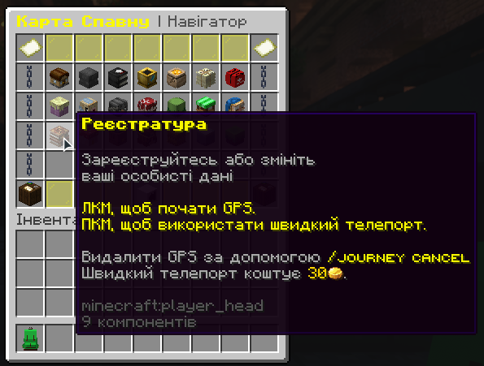

# Перші кроки на сервері

Після того як ти зʼявляєшся на сервері, першим тебе зустрічає **Дід Панас**. Підійди до нього, натисни **ПКМ**, прочитай, що він каже, і натискай **F**, щоб продовжувати розмову. Він пояснить що тебе чекає далі, і дасть напрямок у світ _**«Пачки Вареників»**_.

<figure><figcaption></figcaption></figure>

Далі важливо обрати стать твого персонажа — це вплине на те, як до тебе звертатимуться **NPC** у грі. Але секретар знаходиться далеко, тому доведеться пройтись. Відкрий **рюкзак виживальника**, знайди **карту спавну** і натисни **ЛКМ** або **ПКМ** на пункт **“Реєстратура”.**

<figure><figcaption></figcaption></figure>

Зʼявиться стрілка, яка покаже тобі шлях. Як дійдеш — підійди до **NPC**, натисни **ПКМ**, прокрути колесо миші, вибери стать і натисни **F**, щоб підтвердити.

<figure><figcaption></figcaption></figure>

**Це твої перші кроки на сервері — вони допоможуть тобі налаштувати персонажа, краще зрозуміти, як усе працює, і підготуватись до пригод, квестів і створення власної країни!**
