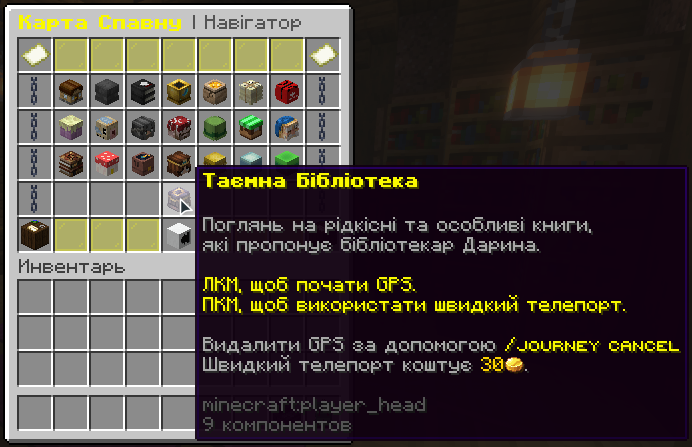

# Кастомні зачарування

Minecraft. Вони дають унікальні ефекти — наприклад, шанс завдати критичний удар, відкинути ворога, відновити здоров’я, або навіть викликати блискавку!

Кожне зачарування має **свій рівень**, ефект і тип предмета, на який його можна накласти.

***

#### 🔍 **Як переглянути доступні зачарування**

1. Відкрий **рюкзак виживальника**
2. Зайди в **карту спавна**
3. Обери пункт **“Таємничий бібліотекар”** — саме вона відповідає за зачарування
   * **ЛКМ** — зʼявиться стрілка (безкоштовно)
   * **ПКМ** — телепорт одразу (30 монет)

<figure><figcaption></figcaption></figure>

Також у рюкзаку є **список усіх кастомних зачарувань** — з описами та рівнями. Переглянь його, щоб знати, які з них найкраще підходять для бою, шахтарства чи виживання.

Each enchantment in the tables below includes attributes that are possible for the player to acquire legitimately in Survival mode. Attributes can be changed in the enchantment configuration files.

* **Max Level**: Maximum levels for enchantments.
* **Primary Items**: The items that can receive the enchantment legitimately in Survival mode by using an enchanting table.
* **Secondary Items**: Items that, in Survival mode, cannot receive the enchantment from an enchanting table but can from an enchanted book with an anvil.
* **Weight**: Relative probability of the enchantment being offered.

Most enchantments have a configurable per-level probability to be triggered.

## Armor

| Name                 | Summary                                                                                                                    | Incompatible With                                           | Max Level | Primary Items                                                                                                                                                                                                                                                                 | Secondary Items                                                    | Weight |
| -------------------- | -------------------------------------------------------------------------------------------------------------------------- | ----------------------------------------------------------- | --------- | ----------------------------------------------------------------------------------------------------------------------------------------------------------------------------------------------------------------------------------------------------------------------------- | ------------------------------------------------------------------ | ------ |
| Cold Steel           | Applies [Mining Fatigue](https://minecraft.wiki/w/Mining_Fatigue) effect to the attacker.                                  |                                                             | III       | !\[]\(./Enchantments \_ ExcellentEnchants Wiki\_files/chestplate.webp)                                                                                                                                                                                                        | !\[]\(./Enchantments \_ ExcellentEnchants Wiki\_files/elytra.webp) | 5      |
| Darkness Cloak       | Applies [Darkness](https://minecraft.wiki/w/Darkness) effect to the attacker.                                              |                                                             | III       | !\[]\(./Enchantments \_ ExcellentEnchants Wiki\_files/chestplate.webp)                                                                                                                                                                                                        | !\[]\(./Enchantments \_ ExcellentEnchants Wiki\_files/elytra.webp) | 10     |
| Elemental Protection | Reduces potion and elemental damage.                                                                                       |                                                             | IV        | !\[]\(./Enchantments \_ ExcellentEnchants Wiki\_files/helmet.webp)!\[]\(./Enchantments \_ ExcellentEnchants Wiki\_files/chestplate.webp)!\[]\(./Enchantments \_ ExcellentEnchants Wiki\_files/leggings.webp)!\[]\(./Enchantments \_ ExcellentEnchants Wiki\_files/boots.webp) |                                                                    | 10     |
| Fire Shield          | Ignites the attacker.                                                                                                      |                                                             | IV        | !\[]\(./Enchantments \_ ExcellentEnchants Wiki\_files/chestplate.webp)                                                                                                                                                                                                        | !\[]\(./Enchantments \_ ExcellentEnchants Wiki\_files/elytra.webp) | 2      |
| Flame Walker         | Ability to walk on lava, immunity to magma damage.                                                                         | [Frost Walker](https://minecraft.wiki/w/Frost_Walker)       | II        | !\[]\(./Enchantments \_ ExcellentEnchants Wiki\_files/boots.webp)                                                                                                                                                                                                             |                                                                    | 1      |
| Hardened             | Grants [Resistance](https://minecraft.wiki/w/Resistance) effect on receiving damage.                                       |                                                             | II        | !\[]\(./Enchantments \_ ExcellentEnchants Wiki\_files/chestplate.webp)                                                                                                                                                                                                        | !\[]\(./Enchantments \_ ExcellentEnchants Wiki\_files/elytra.webp) | 5      |
| Ice Shield           | [Freezes](https://minecraft.wiki/w/Powder_Snow#Freezing) and [slows down](https://minecraft.wiki/w/Slowness) the attacker. |                                                             | III       | !\[]\(./Enchantments \_ ExcellentEnchants Wiki\_files/chestplate.webp)                                                                                                                                                                                                        | !\[]\(./Enchantments \_ ExcellentEnchants Wiki\_files/elytra.webp) | 10     |
| Jumping              | Grants [Jump Boost](https://minecraft.wiki/w/Jump_Boost) effect.                                                           |                                                             | II        | !\[]\(./Enchantments \_ ExcellentEnchants Wiki\_files/boots.webp)                                                                                                                                                                                                             |                                                                    | 2      |
| Kamikadze            | Creates an explosion on death.                                                                                             |                                                             | III       | !\[]\(./Enchantments \_ ExcellentEnchants Wiki\_files/chestplate.webp)                                                                                                                                                                                                        | !\[]\(./Enchantments \_ ExcellentEnchants Wiki\_files/elytra.webp) | 5      |
| Night Vision         | Grants [Night Vision](https://minecraft.wiki/w/Night_Vision) effect.                                                       |                                                             | I         | !\[]\(./Enchantments \_ ExcellentEnchants Wiki\_files/helmet.webp)                                                                                                                                                                                                            |                                                                    | 1      |
| Rebound              | Gives the effect of landing on a [Slime Block](https://minecraft.wiki/w/Slime_Block#Bouncing).                             | [Feather Falling](https://minecraft.wiki/w/Feather_Falling) | I         | !\[]\(./Enchantments \_ ExcellentEnchants Wiki\_files/boots.webp)                                                                                                                                                                                                             |                                                                    | 2      |
| Regrowth             | Restores certain amount of hearts over the time.                                                                           |                                                             | IV        | !\[]\(./Enchantments \_ ExcellentEnchants Wiki\_files/chestplate.webp)                                                                                                                                                                                                        | !\[]\(./Enchantments \_ ExcellentEnchants Wiki\_files/elytra.webp) | 2      |
| Saturation           | Restores certain amount of food over the time.                                                                             |                                                             | II        | !\[]\(./Enchantments \_ ExcellentEnchants Wiki\_files/helmet.webp)                                                                                                                                                                                                            |                                                                    | 2      |
| Speed                | Grants [Speed](https://minecraft.wiki/w/Speed) effect.                                                                     |                                                             | II        | !\[]\(./Enchantments \_ ExcellentEnchants Wiki\_files/boots.webp)                                                                                                                                                                                                             |                                                                    | 2      |
| Stopping Force       | Reduces [Knockback](https://minecraft.wiki/w/Knockback_\(mechanic\)) when getting damage.                                  |                                                             | III       | !\[]\(./Enchantments \_ ExcellentEnchants Wiki\_files/leggings.webp)                                                                                                                                                                                                          |                                                                    | 5      |
| Water Breathing      | Grants [Water Breathing effect](https://minecraft.wiki/w/Water_Breathing) effect.                                          |                                                             | I         | !\[]\(./Enchantments \_ ExcellentEnchants Wiki\_files/helmet.webp)                                                                                                                                                                                                            |                                                                    | 1      |

## Bow

| Name               | Summary                                                                                                         | Incompatible With                                                                                                    | Max Level | Primary Items                                                   | Secondary Items                                                      | Weight |
| ------------------ | --------------------------------------------------------------------------------------------------------------- | -------------------------------------------------------------------------------------------------------------------- | --------- | --------------------------------------------------------------- | -------------------------------------------------------------------- | ------ |
| Bomber             | Shoots [TNT](https://minecraft.wiki/w/TNT) instead of arrows.                                                   | (Non-)Arrow enchants [1](kastomni-zacharuvannya.md#notes) [2](kastomni-zacharuvannya.md#notes) | III       | !\[]\(./Enchantments \_ ExcellentEnchants Wiki\_files/bow.webp) | !\[]\(./Enchantments \_ ExcellentEnchants Wiki\_files/crossbow.webp) | 1      |
| Confusing Arrows   | Applies [Nausea](https://minecraft.wiki/w/Nausea) effect on arrows.                                             | Non-Arrow enchants [2](kastomni-zacharuvannya.md#notes)                                                   | III       | !\[]\(./Enchantments \_ ExcellentEnchants Wiki\_files/bow.webp) | !\[]\(./Enchantments \_ ExcellentEnchants Wiki\_files/crossbow.webp) | 10     |
| Darkness Arrows    | Applies [Darkness](https://minecraft.wiki/w/Darkness) effect on arrows.                                         | Non-Arrow enchants [2](kastomni-zacharuvannya.md#notes)                                                   | III       | !\[]\(./Enchantments \_ ExcellentEnchants Wiki\_files/bow.webp) | !\[]\(./Enchantments \_ ExcellentEnchants Wiki\_files/crossbow.webp) | 10     |
| Dragonfire Arrows  | Applies [Dragon's Breath](https://minecraft.wiki/w/Dragon's_Breath) effect on arrows.                           | Non-Arrow enchants [2](kastomni-zacharuvannya.md#notes)                                                   | III       | !\[]\(./Enchantments \_ ExcellentEnchants Wiki\_files/bow.webp) | !\[]\(./Enchantments \_ ExcellentEnchants Wiki\_files/crossbow.webp) | 2      |
| Electrified Arrows | Summons [Lightning](https://minecraft.wiki/w/Thunderstorm#Lightning) on hit.                                    | Non-Arrow enchants [2](kastomni-zacharuvannya.md#notes)                                                   | III       | !\[]\(./Enchantments \_ ExcellentEnchants Wiki\_files/bow.webp) | !\[]\(./Enchantments \_ ExcellentEnchants Wiki\_files/crossbow.webp) | 5      |
| Ender Bow          | Shoots [Ender Pearls](https://minecraft.wiki/w/Ender_Pearl) instead of arrows.                                  | (Non-)Arrow enchants [1](kastomni-zacharuvannya.md#notes) [2](kastomni-zacharuvannya.md#notes) | I         | !\[]\(./Enchantments \_ ExcellentEnchants Wiki\_files/bow.webp) | !\[]\(./Enchantments \_ ExcellentEnchants Wiki\_files/crossbow.webp) | 1      |
| Explosive Arrows   | Arrows [Explodes](https://minecraft.wiki/w/Explosion) on hit.                                                   | Non-Arrow enchants [2](kastomni-zacharuvannya.md#notes)                                                   | III       | !\[]\(./Enchantments \_ ExcellentEnchants Wiki\_files/bow.webp) | !\[]\(./Enchantments \_ ExcellentEnchants Wiki\_files/crossbow.webp) | 5      |
| Flare              | Places a [Torch](https://minecraft.wiki/w/Torch) where arrow land.                                              | Non-Arrow enchants [2](kastomni-zacharuvannya.md#notes)                                                   | I         | !\[]\(./Enchantments \_ ExcellentEnchants Wiki\_files/bow.webp) | !\[]\(./Enchantments \_ ExcellentEnchants Wiki\_files/crossbow.webp) | 5      |
| Ghast              | Shoots [Fireball](https://minecraft.wiki/w/Fireball) instead of arrows.                                         | (Non-)Arrow enchants [1](kastomni-zacharuvannya.md#notes) [2](kastomni-zacharuvannya.md#notes) | I         | !\[]\(./Enchantments \_ ExcellentEnchants Wiki\_files/bow.webp) | !\[]\(./Enchantments \_ ExcellentEnchants Wiki\_files/crossbow.webp) | 1      |
| Hover              | Applies [Levitation](https://minecraft.wiki/w/Levitation) effect on arrows.                                     | Non-Arrow enchants [2](kastomni-zacharuvannya.md#notes)                                                   | III       | !\[]\(./Enchantments \_ ExcellentEnchants Wiki\_files/bow.webp) | !\[]\(./Enchantments \_ ExcellentEnchants Wiki\_files/crossbow.webp) | 10     |
| Lingering          | Arrows with a [lingering](https://minecraft.wiki/w/Lingering_Potion#Creating_area_effect_clouds) effect on hit. | Non-Arrow enchants [2](kastomni-zacharuvannya.md#notes)                                                   | III       | !\[]\(./Enchantments \_ ExcellentEnchants Wiki\_files/bow.webp) | !\[]\(./Enchantments \_ ExcellentEnchants Wiki\_files/crossbow.webp) | 2      |
| Poisoned Arrows    | Applies [Poison](https://minecraft.wiki/w/Poison) effect on arrows.                                             | Non-Arrow enchants [2](kastomni-zacharuvannya.md#notes)                                                   | III       | !\[]\(./Enchantments \_ ExcellentEnchants Wiki\_files/bow.webp) | !\[]\(./Enchantments \_ ExcellentEnchants Wiki\_files/crossbow.webp) | 5      |
| Sniper             | Increases projectile speed.                                                                                     |                                                                                                                      | II        | !\[]\(./Enchantments \_ ExcellentEnchants Wiki\_files/bow.webp) | !\[]\(./Enchantments \_ ExcellentEnchants Wiki\_files/crossbow.webp) | 10     |
| Vampiric Arrows    | Restores health on hit.                                                                                         | Non-Arrow enchants [2](kastomni-zacharuvannya.md#notes)                                                   | III       | !\[]\(./Enchantments \_ ExcellentEnchants Wiki\_files/bow.webp) | !\[]\(./Enchantments \_ ExcellentEnchants Wiki\_files/crossbow.webp) | 2      |
| Withered Arrows    | Applies [Wither](https://minecraft.wiki/w/Wither_\(effect\)) effect on arrows.                                  | Non-Arrow enchants [2](kastomni-zacharuvannya.md#notes)                                                   | III       | !\[]\(./Enchantments \_ ExcellentEnchants Wiki\_files/bow.webp) | !\[]\(./Enchantments \_ ExcellentEnchants Wiki\_files/crossbow.webp) | 5      |

## Tool

| Name          | Summary                                                                                      | Incompatible With                                               | Max Level | Primary Items                                                                                                                                                                                                                                                       | Secondary Items                                                                                                                                                                                      | Weight |
| ------------- | -------------------------------------------------------------------------------------------- | --------------------------------------------------------------- | --------- | ------------------------------------------------------------------------------------------------------------------------------------------------------------------------------------------------------------------------------------------------------------------- | ---------------------------------------------------------------------------------------------------------------------------------------------------------------------------------------------------- | ------ |
| Blast Mining  | Mines blocks with [Explosions](https://minecraft.wiki/w/Explosion).                          | Tunnel, Veinminer                                               | V         | !\[]\(./Enchantments \_ ExcellentEnchants Wiki\_files/pickaxe.webp)                                                                                                                                                                                                 |                                                                                                                                                                                                      | 2      |
| Glass Breaker | Breaks glass instantly.                                                                      |                                                                 | I         | !\[]\(./Enchantments \_ ExcellentEnchants Wiki\_files/pickaxe.webp)!\[]\(./Enchantments \_ ExcellentEnchants Wiki\_files/axe.webp)!\[]\(./Enchantments \_ ExcellentEnchants Wiki\_files/shovel.webp)                                                                | !\[]\(./Enchantments \_ ExcellentEnchants Wiki\_files/hoe.webp)!\[]\(./Enchantments \_ ExcellentEnchants Wiki\_files/shears.webp)                                                                    | 10     |
| Haste         | Applies [Haste](https://minecraft.wiki/w/Haste) effect on mining.                            |                                                                 | III       | !\[]\(./Enchantments \_ ExcellentEnchants Wiki\_files/pickaxe.webp)!\[]\(./Enchantments \_ ExcellentEnchants Wiki\_files/axe.webp)!\[]\(./Enchantments \_ ExcellentEnchants Wiki\_files/shovel.webp)                                                                | !\[]\(./Enchantments \_ ExcellentEnchants Wiki\_files/hoe.webp)!\[]\(./Enchantments \_ ExcellentEnchants Wiki\_files/shears.webp)                                                                    | 2      |
| Lucky Miner   | Produces more [XP](https://minecraft.wiki/w/Experience) from mined blocks.                   |                                                                 | III       | !\[]\(./Enchantments \_ ExcellentEnchants Wiki\_files/pickaxe.webp)                                                                                                                                                                                                 |                                                                                                                                                                                                      | 5      |
| Replanter     | Replants [Crops](https://minecraft.wiki/w/Crops) on harvest or right-click.                  |                                                                 | I         | !\[]\(./Enchantments \_ ExcellentEnchants Wiki\_files/hoe.webp)                                                                                                                                                                                                     |                                                                                                                                                                                                      | 1      |
| Silk Chest    | Drops [Chests](https://minecraft.wiki/w/Chest) that keeps their content.                     |                                                                 | I         | !\[]\(./Enchantments \_ ExcellentEnchants Wiki\_files/axe.webp)                                                                                                                                                                                                     | !\[]\(./Enchantments \_ ExcellentEnchants Wiki\_files/pickaxe.webp)!\[]\(./Enchantments \_ ExcellentEnchants Wiki\_files/shovel.webp)!\[]\(./Enchantments \_ ExcellentEnchants Wiki\_files/hoe.webp) | 1      |
| Silk Spawner  | Chance to obtain a [Monster Spawner](https://minecraft.wiki/w/Monster_Spawner).              | Smelter                                                         | I         | !\[]\(./Enchantments \_ ExcellentEnchants Wiki\_files/pickaxe.webp)                                                                                                                                                                                                 |                                                                                                                                                                                                      | 1      |
| Smelter       | Smelt dropped items according to their [Recipes](https://minecraft.wiki/w/Smelting#Recipes). | [Silk Touch](https://minecraft.wiki/w/Silk_Touch), Silk Spawner | V         | !\[]\(./Enchantments \_ ExcellentEnchants Wiki\_files/pickaxe.webp)!\[]\(./Enchantments \_ ExcellentEnchants Wiki\_files/axe.webp)!\[]\(./Enchantments \_ ExcellentEnchants Wiki\_files/shovel.webp)                                                                | !\[]\(./Enchantments \_ ExcellentEnchants Wiki\_files/hoe.webp)!\[]\(./Enchantments \_ ExcellentEnchants Wiki\_files/shears.webp)                                                                    | 5      |
| Telekinesis   | Moves all block loot directly to inventory.                                                  |                                                                 | I         | !\[]\(./Enchantments \_ ExcellentEnchants Wiki\_files/pickaxe.webp)!\[]\(./Enchantments \_ ExcellentEnchants Wiki\_files/axe.webp)!\[]\(./Enchantments \_ ExcellentEnchants Wiki\_files/shovel.webp)!\[]\(./Enchantments \_ ExcellentEnchants Wiki\_files/hoe.webp) | !\[]\(./Enchantments \_ ExcellentEnchants Wiki\_files/shears.webp)                                                                                                                                   | 1      |
| Treefeller    | Cuts down an entire tree.                                                                    |                                                                 | I         | !\[]\(./Enchantments \_ ExcellentEnchants Wiki\_files/axe.webp)                                                                                                                                                                                                     |                                                                                                                                                                                                      | 2      |
| Tunnel        | Mines 1x2, 2x2, 3x3 area.                                                                    | Veinminer, Blast Mining                                         | III       | !\[]\(./Enchantments \_ ExcellentEnchants Wiki\_files/pickaxe.webp)                                                                                                                                                                                                 | !\[]\(./Enchantments \_ ExcellentEnchants Wiki\_files/axe.webp)!\[]\(./Enchantments \_ ExcellentEnchants Wiki\_files/shovel.webp)!\[]\(./Enchantments \_ ExcellentEnchants Wiki\_files/hoe.webp)     | 1      |
| Veinminer     | Mines the whole ore vein at once.                                                            | Tunnel, Blast Mining                                            | III       | !\[]\(./Enchantments \_ ExcellentEnchants Wiki\_files/pickaxe.webp)                                                                                                                                                                                                 |                                                                                                                                                                                                      | 1      |

## Fishing

| Name             | Summary                                                                                                    | Incompatible With | Max Level | Primary Items                                                           | Secondary Items | Weight |
| ---------------- | ---------------------------------------------------------------------------------------------------------- | ----------------- | --------- | ----------------------------------------------------------------------- | --------------- | ------ |
| Auto Reel        | Automatically reels in a hook on bite.                                                                     |                   | 1         | !\[]\(./Enchantments \_ ExcellentEnchants Wiki\_files/fishing-rod.webp) |                 | 1      |
| Curse of Drowned | Chance to fish up a [Drowned](https://minecraft.wiki/w/Drowned).                                           |                   | 3         | !\[]\(./Enchantments \_ ExcellentEnchants Wiki\_files/fishing-rod.webp) |                 | 5      |
| Double Catch     | Increases amount of caught item by x2.                                                                     |                   | 3         | !\[]\(./Enchantments \_ ExcellentEnchants Wiki\_files/fishing-rod.webp) |                 | 2      |
| River Master     | Increases casting distance.                                                                                |                   | 5         | !\[]\(./Enchantments \_ ExcellentEnchants Wiki\_files/fishing-rod.webp) |                 | 10     |
| Seasoned Angler  | Increases amount of gained [XP](https://minecraft.wiki/w/Experience).                                      |                   | 3         | !\[]\(./Enchantments \_ ExcellentEnchants Wiki\_files/fishing-rod.webp) |                 | 5      |
| Survivalist      | Automatically [cooks](https://minecraft.wiki/w/Cooking#Cooked_food_recipes) fish if what is caught is raw. |                   | 1         | !\[]\(./Enchantments \_ ExcellentEnchants Wiki\_files/fishing-rod.webp) |                 | 2      |

## Weapon

| Name                | Summary                                                                                                                                        | Incompatible With | Max Level | Primary Items                                                       | Secondary Items                                                 | Weight |
| ------------------- | ---------------------------------------------------------------------------------------------------------------------------------------------- | ----------------- | --------- | ------------------------------------------------------------------- | --------------------------------------------------------------- | ------ |
| Bane of Netherspawn | Increases damage to [nether mobs](https://minecraft.wiki/w/The_Nether#Mobs).                                                                   |                   | V         | !\[]\(./Enchantments \_ ExcellentEnchants Wiki\_files/sword.webp)   | !\[]\(./Enchantments \_ ExcellentEnchants Wiki\_files/axe.webp) | 10     |
| Blindness           | Applies [Blindness](https://minecraft.wiki/w/Blindness) effect on target.                                                                      |                   | II        | !\[]\(./Enchantments \_ ExcellentEnchants Wiki\_files/sword.webp)   | !\[]\(./Enchantments \_ ExcellentEnchants Wiki\_files/axe.webp) | 10     |
| Confusion           | Applies [Nausea](https://minecraft.wiki/w/Nausea) effect on target.                                                                            |                   | II        | !\[]\(./Enchantments \_ ExcellentEnchants Wiki\_files/sword.webp)   | !\[]\(./Enchantments \_ ExcellentEnchants Wiki\_files/axe.webp) | 10     |
| Cure                | Cures [Zombified Piglins](https://minecraft.wiki/w/Zombified_Piglin) and [Zombie Villagers](https://minecraft.wiki/w/Zombie_Villager) on kill. |                   | III       | !\[]\(./Enchantments \_ ExcellentEnchants Wiki\_files/sword.webp)   | !\[]\(./Enchantments \_ ExcellentEnchants Wiki\_files/axe.webp) | 10     |
| Curse of Death      | If you kill a player, you have a chance of dying too.                                                                                          |                   | III       | !\[]\(./Enchantments \_ ExcellentEnchants Wiki\_files/sword.webp)   | !\[]\(./Enchantments \_ ExcellentEnchants Wiki\_files/axe.webp) | 2      |
| Cutter              | Damages and drops target's armor.                                                                                                              |                   | III       | !\[]\(./Enchantments \_ ExcellentEnchants Wiki\_files/sword.webp)   | !\[]\(./Enchantments \_ ExcellentEnchants Wiki\_files/axe.webp) | 2      |
| Decapitator         | Allows to obtain target's head.                                                                                                                |                   | II        | !\[]\(./Enchantments \_ ExcellentEnchants Wiki\_files/sword.webp)   | !\[]\(./Enchantments \_ ExcellentEnchants Wiki\_files/axe.webp) | 2      |
| Double Strike       | Increases damage by twice.                                                                                                                     |                   | II        | !\[]\(./Enchantments \_ ExcellentEnchants Wiki\_files/sword.webp)   | !\[]\(./Enchantments \_ ExcellentEnchants Wiki\_files/axe.webp) | 1      |
| Exhaust             | Applies [Hunger](https://minecraft.wiki/w/Hunger_\(effect\)) effect on target.                                                                 |                   | IV        | !\[]\(./Enchantments \_ ExcellentEnchants Wiki\_files/sword.webp)   | !\[]\(./Enchantments \_ ExcellentEnchants Wiki\_files/axe.webp) | 10     |
| Ice Aspect          | [Freezes](https://minecraft.wiki/w/Powder_Snow#Freezing) and applies [Slowness](https://minecraft.wiki/w/Slowness) on target.                  |                   | III       | !\[]\(./Enchantments \_ ExcellentEnchants Wiki\_files/sword.webp)   | !\[]\(./Enchantments \_ ExcellentEnchants Wiki\_files/axe.webp) | 10     |
| Infernus            | Tridents sets targets on fire.                                                                                                                 |                   | III       | !\[]\(./Enchantments \_ ExcellentEnchants Wiki\_files/trident.webp) |                                                                 | 10     |
| Nimble              | Moves entity's drops directly to inventory.                                                                                                    |                   | I         | !\[]\(./Enchantments \_ ExcellentEnchants Wiki\_files/sword.webp)   | !\[]\(./Enchantments \_ ExcellentEnchants Wiki\_files/axe.webp) | 2      |
| Paralyze            | Applies [Mining Fatigue](https://minecraft.wiki/w/Mining_Fatigue) effect on target.                                                            |                   | V         | !\[]\(./Enchantments \_ ExcellentEnchants Wiki\_files/sword.webp)   | !\[]\(./Enchantments \_ ExcellentEnchants Wiki\_files/axe.webp) | 5      |
| Rage                | Grants [Strength](https://minecraft.wiki/w/Strength) effect in combat.                                                                         |                   | II        | !\[]\(./Enchantments \_ ExcellentEnchants Wiki\_files/sword.webp)   | !\[]\(./Enchantments \_ ExcellentEnchants Wiki\_files/axe.webp) | 5      |
| Rocket              | Launches target into the space.                                                                                                                |                   | III       | !\[]\(./Enchantments \_ ExcellentEnchants Wiki\_files/sword.webp)   | !\[]\(./Enchantments \_ ExcellentEnchants Wiki\_files/axe.webp) | 5      |
| Swiper              | Steals player's [XP](https://minecraft.wiki/w/Experience).                                                                                     |                   | III       | !\[]\(./Enchantments \_ ExcellentEnchants Wiki\_files/sword.webp)   | !\[]\(./Enchantments \_ ExcellentEnchants Wiki\_files/axe.webp) | 2      |
| Temper              | Damage increases the more the less health you have.                                                                                            |                   | V         | !\[]\(./Enchantments \_ ExcellentEnchants Wiki\_files/sword.webp)   | !\[]\(./Enchantments \_ ExcellentEnchants Wiki\_files/axe.webp) | 1      |
| Thrifty             | Drops mob's [Spawn Egg](https://minecraft.wiki/w/Spawn_Egg).                                                                                   |                   | III       | !\[]\(./Enchantments \_ ExcellentEnchants Wiki\_files/sword.webp)   | !\[]\(./Enchantments \_ ExcellentEnchants Wiki\_files/axe.webp) | 2      |
| Thunder             | Summons [Lightning](https://minecraft.wiki/w/Thunderstorm#Lightning) on target with extra damage.                                              |                   | V         | !\[]\(./Enchantments \_ ExcellentEnchants Wiki\_files/sword.webp)   | !\[]\(./Enchantments \_ ExcellentEnchants Wiki\_files/axe.webp) | 5      |
| Vampire             | Steals target's health.                                                                                                                        |                   | III       | !\[]\(./Enchantments \_ ExcellentEnchants Wiki\_files/sword.webp)   | !\[]\(./Enchantments \_ ExcellentEnchants Wiki\_files/axe.webp) | 2      |
| Venom               | Applies [Poison](https://minecraft.wiki/w/Poison) effect on target.                                                                            |                   | II        | !\[]\(./Enchantments \_ ExcellentEnchants Wiki\_files/sword.webp)   | !\[]\(./Enchantments \_ ExcellentEnchants Wiki\_files/axe.webp) | 10     |
| Village Defender    | Increases damage to [Illagers](https://minecraft.wiki/w/Illager).                                                                              |                   | V         | !\[]\(./Enchantments \_ ExcellentEnchants Wiki\_files/sword.webp)   | !\[]\(./Enchantments \_ ExcellentEnchants Wiki\_files/axe.webp) | 10     |
| Wisdom              | Produces more [XP](https://minecraft.wiki/w/Experience) from mobs.                                                                             |                   | V         | !\[]\(./Enchantments \_ ExcellentEnchants Wiki\_files/sword.webp)   | !\[]\(./Enchantments \_ ExcellentEnchants Wiki\_files/axe.webp) | 5      |
| Wither              | Applies [Wither](https://minecraft.wiki/w/Wither_\(effect\)) effect on target.                                                                 |                   | II        | !\[]\(./Enchantments \_ ExcellentEnchants Wiki\_files/sword.webp)   | !\[]\(./Enchantments \_ ExcellentEnchants Wiki\_files/axe.webp) | 5      |

## Universal

| Name                | Summary                                          | Incompatible With                                                                        | Max Level | Primary Items                                                                                                                                                                                                                                                                                                                                                                                                                                                                                                                                                                                                                                                                                                                                                                                                                                                                                                                                                                                                                                                                                                                                                        | Secondary Items                                                                                                                                                                                                                                                        | Weight |
| ------------------- | ------------------------------------------------ | ---------------------------------------------------------------------------------------- | --------- | -------------------------------------------------------------------------------------------------------------------------------------------------------------------------------------------------------------------------------------------------------------------------------------------------------------------------------------------------------------------------------------------------------------------------------------------------------------------------------------------------------------------------------------------------------------------------------------------------------------------------------------------------------------------------------------------------------------------------------------------------------------------------------------------------------------------------------------------------------------------------------------------------------------------------------------------------------------------------------------------------------------------------------------------------------------------------------------------------------------------------------------------------------------------- | ---------------------------------------------------------------------------------------------------------------------------------------------------------------------------------------------------------------------------------------------------------------------- | ------ |
| Curse of Breaking   | Takes more durability points on use.             | [Unbreaking](https://minecraft.wiki/w/Unbreaking)                                        | III       | !\[]\(./Enchantments \_ ExcellentEnchants Wiki\_files/pickaxe.webp)!\[]\(./Enchantments \_ ExcellentEnchants Wiki\_files/axe.webp)!\[]\(./Enchantments \_ ExcellentEnchants Wiki\_files/shovel.webp)!\[]\(./Enchantments \_ ExcellentEnchants Wiki\_files/hoe.webp)!\[]\(./Enchantments \_ ExcellentEnchants Wiki\_files/sword.webp)!\[]\(./Enchantments \_ ExcellentEnchants Wiki\_files/bow.webp)!\[]\(./Enchantments \_ ExcellentEnchants Wiki\_files/crossbow.webp)!\[]\(./Enchantments \_ ExcellentEnchants Wiki\_files/shears.webp)!\[]\(./Enchantments \_ ExcellentEnchants Wiki\_files/helmet.webp)!\[]\(./Enchantments \_ ExcellentEnchants Wiki\_files/chestplate.webp)!\[]\(./Enchantments \_ ExcellentEnchants Wiki\_files/leggings.webp)!\[]\(./Enchantments \_ ExcellentEnchants Wiki\_files/boots.webp)!\[]\(./Enchantments \_ ExcellentEnchants Wiki\_files/elytra.webp)!\[]\(./Enchantments \_ ExcellentEnchants Wiki\_files/shield.webp)!\[]\(./Enchantments \_ ExcellentEnchants Wiki\_files/fishing-rod.webp)!\[]\(./Enchantments \_ ExcellentEnchants Wiki\_files/trident.webp)!\[]\(./Enchantments \_ ExcellentEnchants Wiki\_files/mace.webp) |                                                                                                                                                                                                                                                                        | 10     |
| Curse of Fragility  | Prevents item from being grindstoned or anviled. |                                                                                          | I         | !\[]\(./Enchantments \_ ExcellentEnchants Wiki\_files/pickaxe.webp)!\[]\(./Enchantments \_ ExcellentEnchants Wiki\_files/axe.webp)!\[]\(./Enchantments \_ ExcellentEnchants Wiki\_files/shovel.webp)!\[]\(./Enchantments \_ ExcellentEnchants Wiki\_files/hoe.webp)!\[]\(./Enchantments \_ ExcellentEnchants Wiki\_files/sword.webp)!\[]\(./Enchantments \_ ExcellentEnchants Wiki\_files/bow.webp)!\[]\(./Enchantments \_ ExcellentEnchants Wiki\_files/crossbow.webp)!\[]\(./Enchantments \_ ExcellentEnchants Wiki\_files/shears.webp)!\[]\(./Enchantments \_ ExcellentEnchants Wiki\_files/helmet.webp)!\[]\(./Enchantments \_ ExcellentEnchants Wiki\_files/chestplate.webp)!\[]\(./Enchantments \_ ExcellentEnchants Wiki\_files/leggings.webp)!\[]\(./Enchantments \_ ExcellentEnchants Wiki\_files/boots.webp)!\[]\(./Enchantments \_ ExcellentEnchants Wiki\_files/elytra.webp)!\[]\(./Enchantments \_ ExcellentEnchants Wiki\_files/shield.webp)!\[]\(./Enchantments \_ ExcellentEnchants Wiki\_files/fishing-rod.webp)!\[]\(./Enchantments \_ ExcellentEnchants Wiki\_files/trident.webp)!\[]\(./Enchantments \_ ExcellentEnchants Wiki\_files/mace.webp) |                                                                                                                                                                                                                                                                        | 10     |
| Curse of Mediocrity | Disenchants block's and mob's loot.              |                                                                                          | III       | !\[]\(./Enchantments \_ ExcellentEnchants Wiki\_files/sword.webp)!\[]\(./Enchantments \_ ExcellentEnchants Wiki\_files/axe.webp)!\[]\(./Enchantments \_ ExcellentEnchants Wiki\_files/bow.webp)!\[]\(./Enchantments \_ ExcellentEnchants Wiki\_files/crossbow.webp)!\[]\(./Enchantments \_ ExcellentEnchants Wiki\_files/trident.webp)!\[]\(./Enchantments \_ ExcellentEnchants Wiki\_files/mace.webp)                                                                                                                                                                                                                                                                                                                                                                                                                                                                                                                                                                                                                                                                                                                                                               | !\[]\(./Enchantments \_ ExcellentEnchants Wiki\_files/pickaxe.webp)!\[]\(./Enchantments \_ ExcellentEnchants Wiki\_files/shovel.webp)!\[]\(./Enchantments \_ ExcellentEnchants Wiki\_files/hoe.webp)!\[]\(./Enchantments \_ ExcellentEnchants Wiki\_files/shears.webp) | 5      |
| Curse of Misfortune | Reduces block's and mob's loot to zero.          | [Fortune](https://minecraft.wiki/w/Fortune), [Looting](https://minecraft.wiki/w/Looting) | III       | !\[]\(./Enchantments \_ ExcellentEnchants Wiki\_files/pickaxe.webp)!\[]\(./Enchantments \_ ExcellentEnchants Wiki\_files/axe.webp)!\[]\(./Enchantments \_ ExcellentEnchants Wiki\_files/shovel.webp)!\[]\(./Enchantments \_ ExcellentEnchants Wiki\_files/hoe.webp)!\[]\(./Enchantments \_ ExcellentEnchants Wiki\_files/sword.webp)!\[]\(./Enchantments \_ ExcellentEnchants Wiki\_files/bow.webp)!\[]\(./Enchantments \_ ExcellentEnchants Wiki\_files/crossbow.webp)!\[]\(./Enchantments \_ ExcellentEnchants Wiki\_files/shears.webp)!\[]\(./Enchantments \_ ExcellentEnchants Wiki\_files/trident.webp)!\[]\(./Enchantments \_ ExcellentEnchants Wiki\_files/mace.webp)                                                                                                                                                                                                                                                                                                                                                                                                                                                                                         |                                                                                                                                                                                                                                                                        | 5      |
| Restore             | Saves item from breaking once.                   |                                                                                          | III       | !\[]\(./Enchantments \_ ExcellentEnchants Wiki\_files/pickaxe.webp)!\[]\(./Enchantments \_ ExcellentEnchants Wiki\_files/axe.webp)!\[]\(./Enchantments \_ ExcellentEnchants Wiki\_files/shovel.webp)!\[]\(./Enchantments \_ ExcellentEnchants Wiki\_files/hoe.webp)!\[]\(./Enchantments \_ ExcellentEnchants Wiki\_files/sword.webp)!\[]\(./Enchantments \_ ExcellentEnchants Wiki\_files/bow.webp)!\[]\(./Enchantments \_ ExcellentEnchants Wiki\_files/crossbow.webp)!\[]\(./Enchantments \_ ExcellentEnchants Wiki\_files/shears.webp)!\[]\(./Enchantments \_ ExcellentEnchants Wiki\_files/helmet.webp)!\[]\(./Enchantments \_ ExcellentEnchants Wiki\_files/chestplate.webp)!\[]\(./Enchantments \_ ExcellentEnchants Wiki\_files/leggings.webp)!\[]\(./Enchantments \_ ExcellentEnchants Wiki\_files/boots.webp)!\[]\(./Enchantments \_ ExcellentEnchants Wiki\_files/elytra.webp)!\[]\(./Enchantments \_ ExcellentEnchants Wiki\_files/shield.webp)!\[]\(./Enchantments \_ ExcellentEnchants Wiki\_files/fishing-rod.webp)!\[]\(./Enchantments \_ ExcellentEnchants Wiki\_files/trident.webp)!\[]\(./Enchantments \_ ExcellentEnchants Wiki\_files/mace.webp) |                                                                                                                                                                                                                                                                        | 2      |
| Soulbound           | Prevents item from being dropped upon death.     | [Curse of Vanishing](https://minecraft.wiki/w/Curse_of_Vanishing)                        | I         | !\[]\(./Enchantments \_ ExcellentEnchants Wiki\_files/pickaxe.webp)!\[]\(./Enchantments \_ ExcellentEnchants Wiki\_files/axe.webp)!\[]\(./Enchantments \_ ExcellentEnchants Wiki\_files/shovel.webp)!\[]\(./Enchantments \_ ExcellentEnchants Wiki\_files/hoe.webp)!\[]\(./Enchantments \_ ExcellentEnchants Wiki\_files/sword.webp)!\[]\(./Enchantments \_ ExcellentEnchants Wiki\_files/bow.webp)!\[]\(./Enchantments \_ ExcellentEnchants Wiki\_files/crossbow.webp)!\[]\(./Enchantments \_ ExcellentEnchants Wiki\_files/shears.webp)!\[]\(./Enchantments \_ ExcellentEnchants Wiki\_files/helmet.webp)!\[]\(./Enchantments \_ ExcellentEnchants Wiki\_files/chestplate.webp)!\[]\(./Enchantments \_ ExcellentEnchants Wiki\_files/leggings.webp)!\[]\(./Enchantments \_ ExcellentEnchants Wiki\_files/boots.webp)!\[]\(./Enchantments \_ ExcellentEnchants Wiki\_files/elytra.webp)!\[]\(./Enchantments \_ ExcellentEnchants Wiki\_files/shield.webp)!\[]\(./Enchantments \_ ExcellentEnchants Wiki\_files/fishing-rod.webp)!\[]\(./Enchantments \_ ExcellentEnchants Wiki\_files/trident.webp)!\[]\(./Enchantments \_ ExcellentEnchants Wiki\_files/mace.webp) |                                                                                                                                                                                                                                                                        | 2      |

***

Notes

1. Arrow enchantments are those that rely exclusively on arrows.
2. Non-arrow enchantments are those that replace arrows on shoot with other projectiles, such as: Bomber, Ender Bow, Ghast.

***

💡 Збирай зачаровані книги, комбінуй ефекти, експериментуй — і створюй спорядження, яке зробить тебе справжнім героєм у світі ORBitium!
