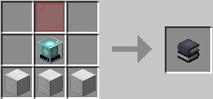

# Країни

**Уяви, що маєш власну територію зі своїми правилами, захистом і навіть гравцями, яким ти можеш довіряти чи заборонити вхід. Це не просто місце для будівництва — це твоя зона впливу, твоя міні-держава у світі Minecraft! Щоб створити власну країну, тобі потрібно 10 000 монет — після цього ти зможеш заявити територію, будувати базу, встановлювати закони, податки та запрошувати інших гравців у свій світ.**

***

## 🔹 Що таке країна?

**Країна — це твоя особиста територія, яку ніхто не може зламати, обікрасти чи зайти без дозволу. Ти повністю контролюєш, що там відбувається: від прав доступу до телепорту та податків.**

***

## 🛠️ Основні команди

<kbd>_**/lands create <назва>**_</kbd> — створити країну

<kbd>_**/lands claim**_</kbd> — додати чанк до своєї країни

<kbd>_**/lands unclaim**_</kbd> — відмовитись від чанку

<kbd>_**/lands trust <нік>**_</kbd> — дати гравцю доступ

<kbd>_**/lands untrust <нік>**_</kbd> — прибрати гравця

<kbd>_**/lands setspawn**_</kbd> — встановити точку спавну

<kbd>_**/lands spawn <назва>**_</kbd> — телепорт до країни

<kbd>_**/lands map**_</kbd>  — переглянути карту навколо

<kbd>_**/lands menu**_</kbd> — відкрити меню керування

***

## 🧑‍🤝‍🧑 Ролі

**У своїй країні ти можеш призначити ролі:**

**Президент** — повний контроль

**Міністр** — допомагає керувати

**Громадянин** — може будувати, копати

**Гість** — доступ залежить від налаштувань

**Ролі налаштовуються в меню&#x20;**_**/lands menu**_**.**

***

## 📐 Підтериторії

**Хочеш розділити країну на зони — наприклад, ферму, склад, житло? Створи підтериторії з окремими правами:**

1. Вибери область <kbd>_**/lands selection**_</kbd>
2. Назви її <kbd>_**/lands assign <назва>**_</kbd>
3. Налаштуй окремі дозволи

***

## 💰 Утримання та податки

**Кожна країна має витрати. Щоб вона не зникла, регулярно поповнюй її баланс.**
\
**Громадянам можна встановити податки — все налаштовується у меню командою&#x20;**<kbd>_**/lands**_</kbd>

***

## ⚔️ **Війни між країнами**

Ти можеш оголосити війну іншій країні командою:

<kbd>/war declare <назва країни></kbd>

Після оголошення війни починається **період очікування тривалістю 48 годин**. Протягом цього часу обидві сторони можуть підготуватись: зібрати ресурси, гравців і захист. Лише після цього війна починається автоматично.

***

## 🏁 **Як виграти війну**

* Перемога нараховується за **активність гравців** і **кількість вбивств**
* Можна також **захопити територію ворога**, якщо вдасться встановити спеціальний **прапор захоплення** _(див. нижче)_
* За бажанням, можна призначити **нагороду переможцю** у момент оголошення

***

## 🧱 **Прапор захоплення**

Щоб захопити територію ворога, тобі потрібно скрафтити **Прапор захоплення**.

📌 **Рецепт крафту:**

* **1 червона шайба**
* **1 маяк**
* **3 блока заліза**

<figure><figcaption></figcaption></figure>

Після встановлення прапора у межах ворожої країни, почнеться **зворотний відлік захоплення**. Якщо супротивник не встигне знищити прапор — частина його території перейде під твоє керування.


💡 **Підказка**: прапор можна встановити лише під час активної фази війни та лише **на заявленій території супротивника**.

**Готуйся, координуй союзників — і покажи, чия країна найсильніша**


***

## 📋 Корисне

<kbd>_**/lands list**_</kbd> — список усіх країн

<kbd>_**/lands info**_</kbd> — інформація про свою

<kbd>_**/lands top**_</kbd> — топ країн за балансом

<kbd>_**/lands chat**_</kbd> — чат тільки для своєї країни

<kbd>_**/lands wild**_</kbd> — телепорт у випадкову точку

<kbd>_**/lands ban <нік>**_</kbd> — заборонити доступ

<kbd>_**/lands setrole <нік> <роль>**_</kbd> — призначити роль

***

## ✅ Поради


**Створи країну одразу після поселення**

**Даючи доступ іншим, обережно налаштовуй ролі**

**Регулярно перевіряй баланс країни**

**Все найзручніше робити через&#x20;**<kbd>_**/lands menu**_</kbd>


***

Твоя країна — твої правила. Створи, розвивай, захищай!
\
Команда для старту:
-------------------

<kbd>_**/lands create <назва>**_</kbd>
