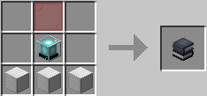

# Країни

## Країни

Країна — це твоя власна захищена територія у світі ORBitium. Тут ти можеш будувати базу, зберігати ресурси, запрошувати інших гравців, видавати їм ролі, налаштовувати права доступу, створювати підтериторії, поповнювати баланс країни та захищати свої землі.

У самому плагіні Lands така територія називається **Land**, але на сервері ORBitium ми називаємо її **країною**.

Щоб створити країну, тобі потрібно **5 000 монет**. Після створення ти отримаєш перший захищений чанк і зможеш поступово розширювати свою територію.

***

### 🔹 Що таке країна?

**Країна** — це приватна територія, яку інші гравці не можуть ламати, грабувати або змінювати без твого дозволу.

У країні ти можеш:

* захистити будинок, ферму, склад або ціле місто;
* додавати друзів і союзників;
* видавати ролі з різними правами;
* забороняти доступ небажаним гравцям;
* створювати окремі зони всередині країни;
* ставити спавн країни;
* користуватись окремим чатом країни;
* поповнювати баланс країни;
* налаштовувати податки та права;
* брати участь у війнах, якщо вони доступні.

***

### 🎒 Де знайти меню країн?

Керувати країною можна двома способами.

#### Через команду

Напиши:

```
/lands
```

Або:

```
/lands menu
```

Це відкриє головне меню країни.

#### Через Рюкзак виживальника

Меню країн також доступне через **Рюкзак виживальника**.

Відкрий рюкзак і знайди розділ або іконку **“Країни”**. Через це меню можна швидко перейти до керування територією без введення команд.

Зазвичай через меню зручніше:

* дивитись інформацію про країну;
* керувати учасниками;
* налаштовувати ролі;
* змінювати права;
* перевіряти баланс;
* дивитись податки;
* керувати підтериторіями.

***

### 🚀 Швидкий старт

Якщо хочеш просто створити країну, зроби так:

```
/lands create <назва> <тег>
/lands setspawn
/lands claim
/lands trust <нік>
/lands
```

Приклад:

```
/lands create Varena VAR
/lands setspawn
/lands claim
/lands trust Steve
/lands
```

Після цього в тебе буде створена країна, встановлений спавн, доданий перший додатковий чанк і запрошений гравець.

***

### 🏗️ Як створити країну

#### Крок 1 — знайди місце

Спочатку знайди місце, де хочеш заснувати країну.

Краще обирати територію, де є:

* достатньо простору для розширення;
* зручний доступ до ресурсів;
* місце для будинків, ферм і складів;
* безпечна відстань від чужих країн.

***

#### Крок 2 — створи країну

Команда:

```
/lands create <назва> <тег>
```

Приклад:

```
/lands create Varena VAR
```

Що означає:

* `Varena` — назва країни;
* `VAR` — короткий тег країни.

Тег краще робити коротким: 2–5 символів.

Приклади тегів:

```
ORB
VAR
SUN
DARK
FARM
```

Якщо команда з тегом не спрацювала, спробуй короткий варіант:

```
/lands create <назва>
```

Приклад:

```
/lands create Varena
```

Після створення країни чанк, у якому ти стоїш, буде автоматично доданий до неї.

***

### 💸 Вартість створення та клейму

На ORBitium зараз діють такі налаштування:

| Дія                          |                       Вартість |
| ---------------------------- | -----------------------------: |
| Створити країну              |                    5 000 монет |
| Перші чанки                  |         128 чанків безкоштовно |
| Додатковий чанк після ліміту |                    3 000 монет |
| Утримання країни             | 3 монети за кожен чанк на день |

Чанк — це ділянка світу розміром **16×16 блоків**.

***

### 📍 Як додати територію

Щоб додати чанк, у якому ти стоїш:

```
/lands claim
```

Щоб прибрати чанк із країни:

```
/lands unclaim
```

Щоб заклеймити кілька чанків навколо себе:

```
/lands claim radius <радіус>
```

Приклад:

```
/lands claim radius 2
```

Це спробує заклеймити чанки навколо тебе в заданому радіусі.

Щоб автоматично клеймити чанки під час руху:

```
/lands claim auto
```

Щоб вимкнути автоматичний клейм, напиши цю команду ще раз.

***

### 🗺️ Як подивитися межі країни

Щоб відкрити карту чанків:

```
/lands map
```

Щоб показати карту прямо в чаті:

```
/lands map chat
```

Карта допомагає зрозуміти:

* де твої чанки;
* де чужі країни;
* куди можна розширюватися;
* які території ще вільні.

Також можна використати:

```
/lands view
```

Ця команда допомагає візуально побачити межі території.

***

### 🏠 Спавн країни

Спавн країни — це точка, куди можуть телепортуватися учасники.

Щоб встановити спавн:

```
/lands setspawn
```

Щоб телепортуватися на спавн своєї країни:

```
/lands spawn
```

Щоб телепортуватися до конкретної країни:

```
/lands spawn <назва>
```

Приклад:

```
/lands spawn Varena
```

Став спавн у безпечному місці: не над лавою, не біля мобів і не там, де гравець може застрягти.

***

### 🧑‍🤝‍🧑 Як додати гравця

Щоб запросити гравця у країну:

```
/lands trust <нік>
```

Приклад:

```
/lands trust Steve
```

Після цього гравець отримає доступ до країни відповідно до своєї ролі.

Щоб прибрати гравця:

```
/lands untrust <нік>
```

Приклад:

```
/lands untrust Steve
```

***

### 🚫 Як заборонити доступ гравцю

Якщо не хочеш, щоб певний гравець заходив на територію країни, використай:

```
/lands ban <нік>
```

Приклад:

```
/lands ban Griefer123
```

Щоб зняти заборону:

```
/lands unban <нік>
```

Приклад:

```
/lands unban Griefer123
```

***

### 👑 Ролі в країні

Ролі потрібні, щоб давати гравцям різні права.

Наприклад:

| Роль       | Що може робити                                                  |
| ---------- | --------------------------------------------------------------- |
| Президент  | Повний контроль над країною                                     |
| Міністр    | Допомагає керувати країною                                      |
| Громадянин | Може будувати, копати та користуватись дозволеними можливостями |
| Гість      | Має обмежений доступ                                            |

Назви ролей можуть відрізнятися залежно від налаштувань сервера.

Найзручніше керувати ролями через меню:

```
/lands
```

Далі відкрий:

```
Країна → Учасники або Ролі
```

Також можна видати роль командою:

```
/lands setrole <нік> <територія> <роль>
```

Якщо хочеш видати роль у всій країні:

```
/lands setrole <нік> * <роль>
```

Приклад:

```
/lands setrole Steve * Громадянин
```

***

### 🔐 Налаштування прав

Права ролей краще налаштовувати через меню:

```
/lands
```

У меню ролей можна дозволити або заборонити:

* будувати;
* ламати блоки;
* відкривати скрині;
* користуватись дверима;
* взаємодіяти з механізмами;
* використовувати кнопки та важелі;
* взаємодіяти з тваринами;
* керувати країною;
* запрошувати гравців;
* змінювати ролі;
* брати участь у війнах.

Не видавай новим гравцям повні права.\
Спочатку краще дати мінімальний доступ, а потім підвищити роль, якщо гравець заслуговує довіри.

***

### 📐 Підтериторії

Підтериторії потрібні, якщо ти хочеш розділити країну на окремі зони.

Наприклад:

* ферма;
* склад;
* магазин;
* житло;
* зона для новачків;
* приватна зона президента;
* зона для івентів.

Кожна підтериторія може мати окремі права.

***

### 🧱 Як створити підтериторію

#### Крок 1 — увімкни виділення

```
/lands selection
```

#### Крок 2 — виділи область

Виділи дві протилежні точки потрібної зони.

#### Крок 3 — розшир виділення по висоті

Якщо хочеш, щоб зона працювала від низу до верху світу:

```
/lands selection expand
```

#### Крок 4 — створи підтериторію

```
/lands assign <назва>
```

Приклад:

```
/lands assign Farma
```

Після цього підтериторію можна налаштовувати окремо через меню країни.

***

### 💰 Баланс країни

У країни є власний баланс. З нього можуть списуватися витрати на утримання.

Щоб подивитися баланс:

```
/lands balance
```

Щоб поповнити баланс:

```
/lands deposit <сума>
```

Приклад:

```
/lands deposit 10000
```

Щоб перевірити витрати на утримання:

```
/lands upkeep
```

Щоб перевірити податки:

```
/lands taxes
```

***

### 🧾 Утримання країни

Країна платить утримання за свої чанки.

На ORBitium утримання зараз становить:

```
3 монети за кожен чанк на день
```

Приклад:

| Кількість чанків | Утримання на день |
| ---------------: | ----------------: |
|        10 чанків |          30 монет |
|        50 чанків |         150 монет |
|       100 чанків |         300 монет |
|       500 чанків |       1 500 монет |

Якщо країна велика, регулярно поповнюй баланс.

***

### 🧑‍💼 Податки

У країні можна налаштовувати податки для учасників.

Податки краще налаштовувати через меню:

```
/lands
```

Податки можуть бути корисні, якщо в країні багато гравців і потрібно разом оплачувати утримання території.

Не став занадто великі податки, інакше учасники можуть піти з країни.

***

### 🏛️ Нації

Нація — це союз кількох країн.

Наприклад:

* кілька міст об’єднуються в одну державу;
* країни створюють альянс;
* кілька груп гравців грають разом;
* союзники разом беруть участь у війнах.

Нації можуть бути тимчасово вимкнені адміністрацією. Якщо команди націй не працюють, значить ця функція зараз недоступна.

Створити націю:

```
/nations create <назва>
```

Приклад:

```
/nations create VarenaUnion
```

Відкрити меню нації:

```
/nations menu
```

Список націй:

```
/nations list
```

Чат нації:

```
/nations chat <повідомлення>
```

Запросити країну до нації:

```
/nations trust <назва_країни>
```

Прийняти запрошення:

```
/nations accept <назва_нації>
```

***

### ⚔️ Війни

Війни дозволяють країнам або націям воювати між собою.

Війни можуть бути тимчасово вимкнені або обмежені адміністрацією. Перед початком війни переконайся, що твоя країна готова.

Оголосити війну:

```
/wars declare <назва країни або нації>
```

Приклад:

```
/wars declare Varena
```

Після оголошення війни починається період підготовки:

```
1 день
```

За цей час обидві сторони можуть:

* зібрати ресурси;
* підготувати броню та зброю;
* покликати союзників;
* укріпити базу;
* поповнити баланс країни;
* розподілити ролі між учасниками.

Подивитися список війн:

```
/wars list
```

Відкрити меню війни:

```
/wars menu
```

Подивитися інформацію про війну:

```
/wars info
```

Телепорт до війни:

```
/wars spawn
```

***

### 🏁 Як виграти війну

Перемога залежить від очок війни.

Очки можна отримати за:

* вбивства гравців ворога;
* встановлення прапора захоплення;
* утримання прапора;
* знищення прапора ворога.

Якщо війна триває занадто довго, вона завершується автоматично.\
Перемагає сторона з більшою кількістю очок.

***

### 🧱 Прапор захоплення

Прапор захоплення потрібен, щоб атакувати територію ворога під час активної війни.

#### Рецепт крафту

<figure><figcaption></figcaption></figure>

Коротко:

* 1 червона скляна панель;
* 1 маяк;
* 3 блоки заліза.

Після встановлення прапора на території ворога починається захоплення.\
Прапор потрібно утримувати **10 хвилин**.

На поточних налаштуваннях сервера захоплена територія стає **незайнятою**, після чого її потрібно буде заклеймити.

Прапор можна встановити лише під час активної фази війни.

***

### 📋 Основні команди

| Команда                         | Що робить                    |
| ------------------------------- | ---------------------------- |
| `/lands`                        | Відкрити головне меню країни |
| `/lands menu`                   | Відкрити меню керування      |
| `/lands help`                   | Показати допомогу            |
| `/lands create <назва> <тег>`   | Створити країну              |
| `/lands edit <назва>`           | Вибрати країну для керування |
| `/lands claim`                  | Додати чанк до країни        |
| `/lands claim radius <радіус>`  | Заклеймити чанки навколо     |
| `/lands claim auto`             | Увімкнути автоматичний клейм |
| `/lands unclaim`                | Прибрати чанк                |
| `/lands unclaim all`            | Прибрати всі чанки країни    |
| `/lands map`                    | Відкрити карту чанків        |
| `/lands map chat`               | Показати карту в чаті        |
| `/lands view`                   | Показати межі території      |
| `/lands info`                   | Інформація про територію     |
| `/lands list`                   | Список країн                 |
| `/lands top`                    | Топ країн                    |
| `/lands setspawn`               | Встановити спавн країни      |
| `/lands spawn`                  | Телепорт до спавну країни    |
| `/lands trust <нік>`            | Додати гравця                |
| `/lands untrust <нік>`          | Прибрати гравця              |
| `/lands ban <нік>`              | Заборонити доступ            |
| `/lands unban <нік>`            | Зняти заборону               |
| `/lands setrole <нік> * <роль>` | Видати роль у всій країні    |
| `/lands chat <повідомлення>`    | Написати в чат країни        |
| `/lands balance`                | Перевірити баланс країни     |
| `/lands deposit <сума>`         | Поповнити баланс             |
| `/lands upkeep`                 | Перевірити утримання         |
| `/lands taxes`                  | Перевірити податки           |

***

### 📋 Команди націй

| Команда                        | Що робить                 |
| ------------------------------ | ------------------------- |
| `/nations create <назва>`      | Створити націю            |
| `/nations menu`                | Відкрити меню нації       |
| `/nations list`                | Список націй              |
| `/nations trust <країна>`      | Запросити країну до нації |
| `/nations accept <нація>`      | Прийняти запрошення       |
| `/nations chat <повідомлення>` | Чат нації                 |

***

### 📋 Команди війн

| Команда                | Що робить                                |
| ---------------------- | ---------------------------------------- |
| `/wars declare <ціль>` | Оголосити війну                          |
| `/wars menu`           | Відкрити меню війни                      |
| `/wars list`           | Список війн                              |
| `/wars info`           | Інформація про війну                     |
| `/wars spawn`          | Телепорт до війни                        |
| `/wars deny`           | Відмовитись від війни, якщо це дозволено |
| `/wars surrender`      | Здатися у війні                          |

***

### ❓ Часті питання

#### Чому я не можу створити країну?

Можливі причини:

* не вистачає монет;
* назва країни зайнята;
* ти вже маєш максимальну кількість країн;
* ця функція тимчасово обмежена;
* ти стоїш у світі або зоні, де клейм заборонений.

***

#### Чому я не можу заклеймити чанк?

Можливі причини:

* чанк уже належить іншій країні;
* не вистачає монет;
* досягнуто ліміт чанків;
* територія заборонена для клейму;
* ти не вибрав потрібну країну через `/lands edit <назва>`.

***

#### Чому друг не може будувати?

Перевір:

* чи доданий він через `/lands trust <нік>`;
* яку роль він має;
* чи дозволено його ролі будівництво;
* чи не стоїть він у підтериторії з окремими правами.

Найпростіше перевірити це через меню:

```
/lands
```

***

#### Чому не працюють нації?

Нації можуть бути вимкнені адміністрацією.\
Якщо команда `/nations create` не працює, значить функція зараз недоступна або ще налаштовується.

***

#### Чому не працюють війни?

Війни можуть бути вимкнені або тимчасово обмежені.\
Також країна може не відповідати вимогам для участі у війні.

***

### ✅ Поради

* Створи країну одразу після того, як знайшов місце для бази.
* Не додавай незнайомих гравців із високими правами.
* Для новачків створи окрему роль із мінімальними дозволами.
* Регулярно поповнюй баланс країни.
* Перевіряй утримання командою `/lands upkeep`.
* Перед війною підготуй ресурси, союзників і спорядження.
* Для великих територій використовуй `/lands selection`.
* Якщо маєш кілька країн, не забувай перемикатися через `/lands edit <назва>`.
* Найзручніше керувати країною через `/lands` або через **Рюкзак виживальника**.

***

### 🧭 Найкоротша інструкція

1. Знайди місце для бази.
2. Напиши:

```
/lands create <назва> <тег>
```

3. Встанови спавн:

```
/lands setspawn
```

4. Додай територію:

```
/lands claim
```

5. Запроси друга:

```
/lands trust <нік>
```

6. Відкрий меню:

```
/lands
```

Або зайди через **Рюкзак виживальника → Країни**.

Твоя країна — твої правила. Створюй, розвивай, запрошуй союзників і захищай свою територію на ORBitium.
