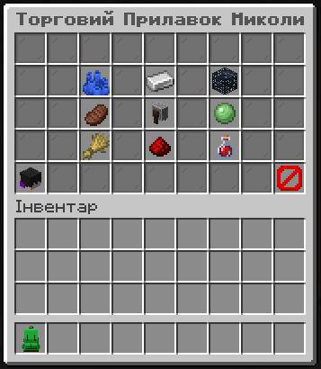

# Торговець Микола

## **Торговець Микола — це NPC, через якого ти можеш купувати й продавати речі.**

**Щоб взаємодіяти з ним:**

1. Підійди до торговця та натисни ПКМ, щоб почати діалог.
2. Коли зʼявиться текст — натискай F, щоби продовжити розмову.
3. Щоб обрати дію (купити, продати, відкрити категорію) — крути колесо миші та натисни F для вибору.
4. Далі відкриється меню — там ти вже зможеш купувати або продавати предмети.

<figure><figcaption></figcaption></figure>

**Все просто — розмовляєш, обираєш, купуєш!**
