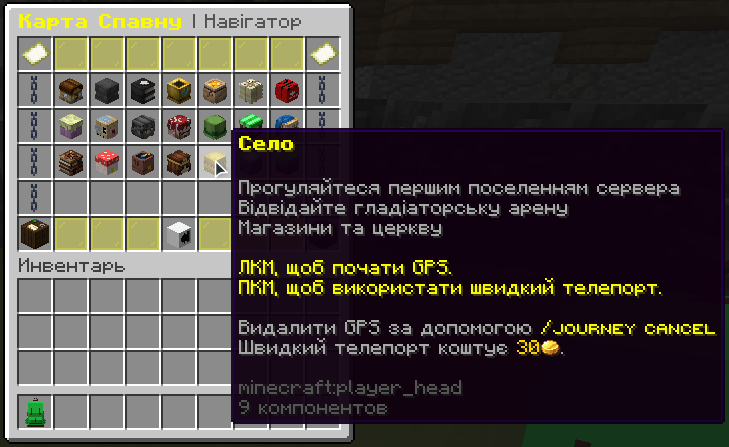

# Оренда на спавні

👑 **Король Артур** вітає тебе в Тронній залі та готовий допомогти з орендою будинку на спавні.

Щоб потрапити до району з будинками, **відкрий рюкзак виживальника**, зайди в **карту спавну** та натисни на пункт **"Село"**.

* **ЛКМ** — стрілка покаже шлях (безкоштовно)
* **ПКМ** — миттєвий телепорт (20 монет)

<figure><figcaption></figcaption></figure>

У королівстві доступні **53 будинки для оренди**, по **одному на кожного гравця**. Щоб орендувати:

* Знайди табличку з написом **“Оренда”** або **“Доступно”**
* Переконайся, що маєш **25 000 монет у гаманці**
* Натисни **ПКМ** по табличці — і будинок твій!

🕒 **Оренда діє 7 днів**. Не забудь її **продовжувати щотижня**, інакше **втратиш будинок**. Усередині можеш облаштувати все, як забажаєш.

👥 Хочеш додати друзів до свого дому? Введи:

```
/house setpermission [нік гравця] [дозвіл] [значення]
```

❌ Хочеш скасувати оренду? Введи:

```
/house resign
```

❓ Забув команди? Введи:

```
/home
```

щоб побачити всі доступні функції.

Це чудова можливість **оселитися прямо в центрі спавну**, поруч із магазинами, подіями та NPC!
