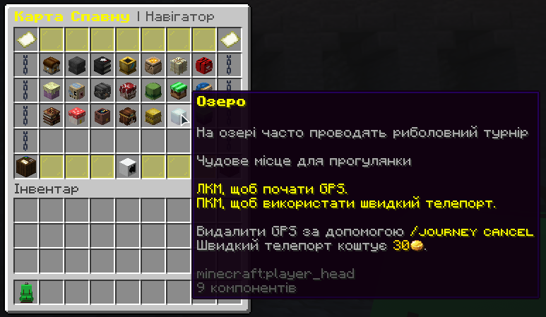
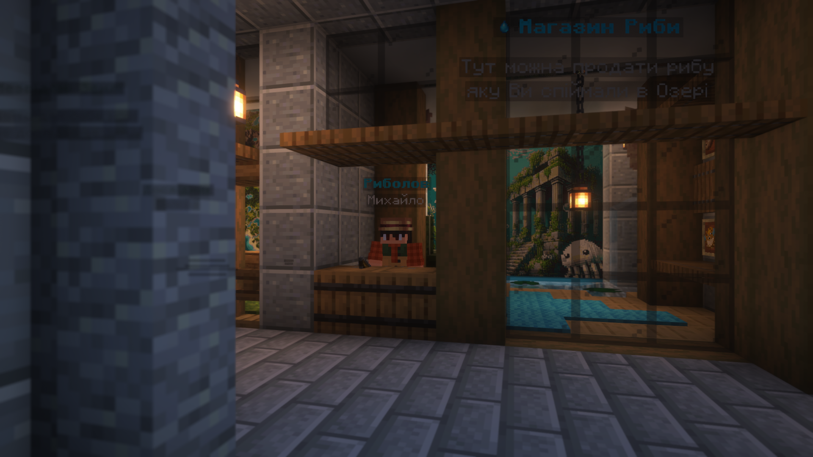

# Риболовля

## **На сервері щодня о 11:00 за Києвом&#x20;**_**(окрім неділі)**_**&#x20;проходить івент, де ти можеш отримати рідкісні нагороди, досвід і просто круто провести час з іншими гравцями.**

**Щоб потрапити на івент, зайди у режим виживальника, відкрий карту спавну, знайди пункт "Озеро" та вибери один із двох способів добирання:**

**ЛКМ** у навігаторі — зʼявиться стрілка, йди сам (безкоштовно)

**ПКМ** у навігаторі — телепорт одразу (20 монет)

<figure><figcaption></figcaption></figure>

Також у центрі спавна ти можеш знайти **НПС Рибака** — він видає завдання на ловлю риби та купує твій улов за монети. Іноді в нього з’являються спеціальні рибальські квести, які дають додаткову винагороду!

<figure><figcaption></figcaption></figure>

## **Не пропускай івенти — вони оновлюються щодня та дарують багато цікавого.**
