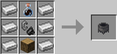

# Спрага

Щоб приготувати чисту пляшку води, візьміть у руки пусту пляшку та підійдіть до будь-якого джерела води – натисніть ПКМ, і пляшка автоматично наповниться. Далі скрафтіть особливий котел:

* **9 залізних злитків**
* **1 кресало**
* **1 дубова колода**
* **1 пляшка брудної води**

<figure><figcaption>
Крафт <strong>машини фільтрації</strong>
</figcaption></figure>

Та встановіть його на рівній поверхні. Підведіться до котла, натисніть ПКМ, щоб відкрити його меню, і покладіть у будь-який вільний слот наповнену пляшку. Після короткої обробки ви отримаєте **фільтровану воду**, яке втамує вашу спрагу.
