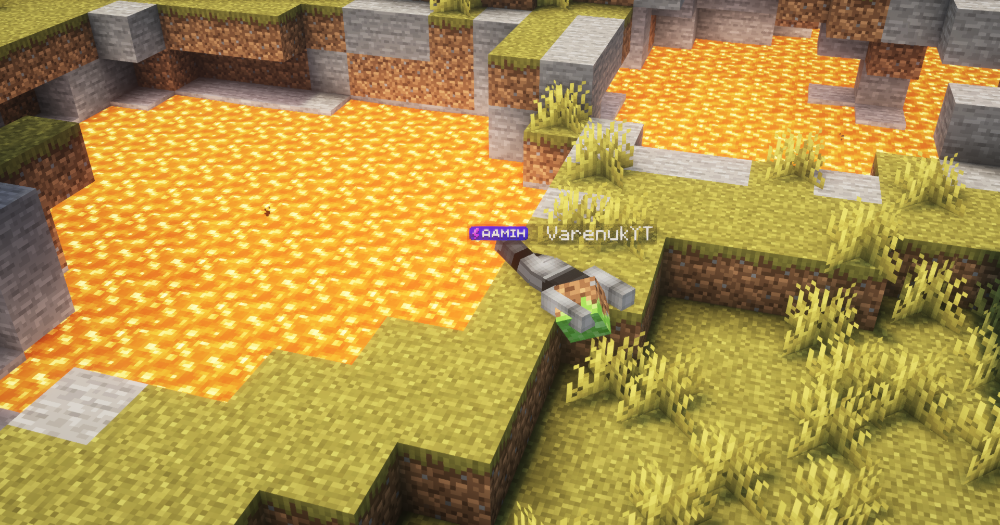

# Відродження

Якщо ви загинули — це ще не кінець. У вас є **3 хвилини**, щоб хтось із гравців **підняв вас**. Для цього інший гравець має **підійти**, **присісти (Shift)** біля вас і **натиснути ПКМ**.

Якщо ви не хочете чекати — введіть команду **/die**, і ваше тіло одразу загине остаточно.

Після цього _(або якщо минуло 3 хвилини)_ — **з’являється труп**, який **існує приблизно 5 хвилин**. Саме в ньому і залишаються всі ваші речі. Ви можете повернутися до трупа та **забрати спорядження**, натиснувши по ньому **ПКМ**.

Пам’ятайте: лише ви можете відкрити свій труп. Не соромтесь кликати на допомогу, щоб не втратити все!

<figure><figcaption></figcaption></figure>
