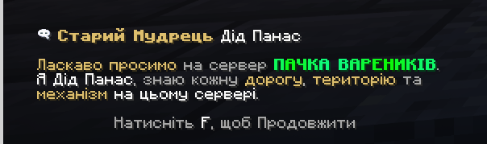
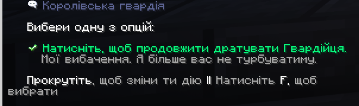

# Взаємодія з нпс

Для взаємодії з **NPC** підійдіть до нього та натисніть праву кнопку миші _**(ПКМ)**_, щоб відкрити вікно діалогу.\
Уважно прочитайте текст у чаті, після чого натисніть **F** для переходу до наступного повідомлення.\
Скористайтеся колесом прокрутки миші, щоб обрати потрібну опцію, та підтвердьте вибір повторним натисканням **F**.\
**Повторюйте ці кроки доти, доки діалог не завершиться.**

<figure><figcaption></figcaption></figure>

<figure><figcaption></figcaption></figure>
